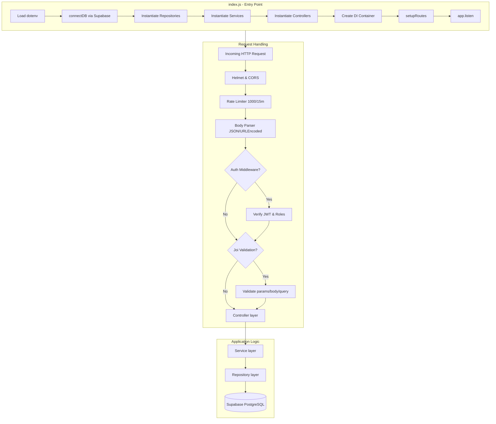
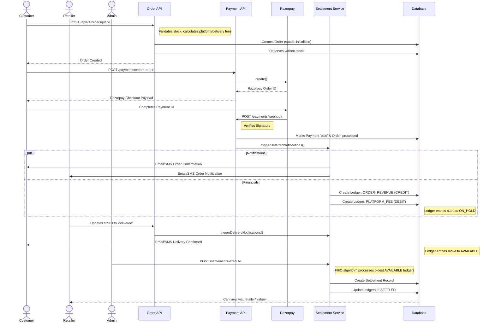

# Bukizz Node Server — Complete Context Document

## 1. Project Overview

**Bukizz** is a **school e-commerce platform** API backend. It enables parents/students to purchase school supplies (books, uniforms, stationery) online, organized by school and grade. The platform supports three user roles: **Customer**, **Retailer**, and **Admin**.

| Attribute | Value |
|---|---|
| **Runtime** | Node.js ≥ 18 (ES Modules) |
| **Framework** | Express 4.18 |
| **Database** | Supabase (PostgreSQL) |
| **Auth** | JWT (custom) + Supabase Auth (Google OAuth) + OTP (email-based) |
| **Payments** | Razorpay (orders, webhooks, penny-drop bank verification) |
| **Validation** | Joi |
| **File Uploads** | Multer (memory storage → Supabase Storage) |
| **Logging** | Winston (file + console) |
| **Security** | Helmet, CORS, express-rate-limit, bcryptjs, AES-256-GCM encryption |
| **Email** | Nodemailer (OTP, order confirmations, retailer notifications, delivery confirmations, password resets) — HTML templates |
| **SMS** | MSG91 Flow API (order confirmation, delivery notification) |
| **Cron Jobs** | node-cron (daily sitemap generation) |
| **Containerization** | Docker + docker-compose |

---

## 2. Local Setup & Onboarding

### Prerequisites
- Node.js (≥ 18)
- PostgreSQL / Supabase locally or hosted
- Docker & docker-compose (optional, for running dependencies locally)

### Step-by-Step Setup
1. **Clone & Install:**
   ```bash
   cd Bukizz/server
   npm install
   ```
2. **Environment Variables:**
   Copy `.env.example` to `.env` and fill in the required values (refer to section 16 for variables).
   ```bash
   cp .env.example .env
   ```
3. **Database Setup:**
   - Create a new project in Supabase (or run locally).
   - Execute the SQL from `src/db/schema.sql` to initialize tables, types, triggers, and RPCs.
   - Run the migrations from `src/db/` to ensure the schema is up-to-date.
   - (Optional) Run `src/db/init.sql` to populate sample data.
4. **Run the Development Server:**
   ```bash
   npm run dev
   ```
   The server will start on `http://localhost:3001` (or your configured `PORT`).

---

## 3. Folder Structure

```
bukizz_node_server/
├── index.js                    # Main entry point — boots server, wires DI, legacy auth routes, cron jobs
├── package.json                # Dependencies & scripts
├── Dockerfile                  # Docker image config
├── docker-compose.yml          # Multi-service orchestration
├── healthcheck.js              # Container health check
├── .env / .env.example         # Environment variables
├── nodemon.json                # Dev server config
├── postman.json                # Postman collection
├── public/
│   └── sitemap.xml             # Auto-generated sitemap (served statically)
├── scripts/
│   ├── testCategoryApi.js      # Category API integration tests
│   ├── testOrderApi.js         # Order API integration tests
│   └── testSchoolApi.js        # School API integration tests
└── src/
    ├── app.js                  # Alternative entry (CJS, not actively used)
    ├── config/
    │   ├── index.js            # Centralized config (env vars, CORS, JWT, DB, uploads, encryption)
    │   └── dependencies.js     # DI container factory (Repository→Service→Controller)
    ├── db/
    │   ├── index.js            # Supabase client init, query helpers, RPC helpers
    │   ├── schema.sql          # Full DDL — all tables, types, indexes, triggers, RPC functions
    │   ├── init.sql            # Sample seed data for development/testing
    │   ├── sample_variant_data.sql
    │   ├── functions/
    │   │   └── create_comprehensive_product.sql  # RPC for atomic product creation
    │   └── migrations (20 files)                 # See § Migration Summary
    ├── jobs/
    │   └── cronJobs.js         # Cron scheduler — daily sitemap generation + startup run
    ├── middleware/
    │   ├── index.js            # setupMiddleware() — helmet, cors, compression, rate limit
    │   ├── authMiddleware.js   # authenticateToken, optionalAuth, requireRoles, requireOwnership
    │   ├── errorHandler.js     # AppError class, errorHandler, notFoundHandler, asyncHandler
    │   ├── rateLimiter.js      # createRateLimiter, createAuthRateLimiter
    │   ├── upload.js           # Multer config (10MB, images only, memory storage)
    │   └── validator.js        # Joi validate() middleware, preprocessBody, sanitizeMiddleware
    ├── models/
    │   └── schemas.js          # ALL Joi validation schemas (~1045 lines)
    ├── templates/              # HTML email templates
    │   ├── forgot-password.html
    │   ├── order-confirmation-customer.html
    │   ├── order-delivery-customer.html
    │   └── order-notification-retailer.html
    ├── controllers/            # Request handling layer — 17 controllers
    │   ├── authController.js
    │   ├── brandController.js
    │   ├── categoryController.js
    │   ├── dashboardController.js          # Retailer dashboard aggregated overview
    │   ├── imageController.js
    │   ├── orderController.js
    │   ├── paymentController.js            # Razorpay create/verify/webhook/reconcile + deferred emails
    │   ├── pincodeController.js
    │   ├── productController.js
    │   ├── retailerBankAccountController.js # Bank account CRUD + Razorpay penny drop
    │   ├── retailerController.js
    │   ├── retailerOrderController.js      # Warehouse-scoped order management
    │   ├── retailerSchoolController.js
    │   ├── schoolController.js
    │   ├── settlementController.js         # Financial settlements, ledgers, payouts
    │   ├── userController.js
    │   └── warehouseController.js
    ├── services/               # Business logic layer — 15 services
    │   ├── authService.js
    │   ├── categoryService.js
    │   ├── emailService.js                 # OTP, order confirmation, retailer notification, delivery, password reset
    │   ├── imageService.js
    │   ├── orderService.js                 # Commission tracking, deferred notifications, per-item cancellation
    │   ├── productService.js
    │   ├── razorpayVerificationService.js  # Bank account penny drop via Razorpay FAV API
    │   ├── retailerBankAccountService.js   # Bank account business logic (AES encryption)
    │   ├── retailerSchoolService.js
    │   ├── retailerService.js
    │   ├── schoolService.js
    │   ├── settlementService.js            # FIFO partial settlement algorithm
    │   ├── smsService.js                   # MSG91 Flow API integration
    │   ├── userService.js
    │   └── warehouseService.js
    ├── repositories/           # Data access layer — 21 repositories
    │   ├── brandRepository.js
    │   ├── categoryRepository.js
    │   ├── ledgerRepository.js             # seller_ledgers CRUD, FIFO queries, dashboard summary
    │   ├── orderEventRepository.js
    │   ├── orderQueryRepository.js
    │   ├── orderRepository.js
    │   ├── otpRepository.js
    │   ├── pincodeRepository.js
    │   ├── productImageRepository.js
    │   ├── productOptionRepository.js
    │   ├── productPaymentMethodRepository.js # product_payment_methods CRUD
    │   ├── productRepository.js
    │   ├── productVariantRepository.js
    │   ├── retailerBankAccountRepository.js  # retailer_bank_accounts CRUD
    │   ├── retailerRepository.js
    │   ├── retailerSchoolRepository.js
    │   ├── schoolRepository.js
    │   ├── settlementRepository.js           # settlements & settlement_ledger_items, FIFO RPC
    │   ├── userRepository.js
    │   ├── variantCommissionRepository.js    # variant_commissions CRUD (versioned, effective_from/to)
    │   └── warehouseRepository.js
    ├── routes/                 # Route definitions — 17 files
    │   ├── index.js            # Master router — mounts all modules under /api/v1
    │   ├── authRoutes.js
    │   ├── brandRoutes.js
    │   ├── categoryRoutes.js
    │   ├── imageRoutes.js
    │   ├── orderRoutes.js
    │   ├── paymentRoutes.js
    │   ├── pincodeRoutes.js
    │   ├── productRoutes.js
    │   ├── retailerBankAccountRoutes.js     # /api/v1/retailer/bank-accounts
    │   ├── retailerOrderRoutes.js           # /api/v1/retailer/orders
    │   ├── retailerRoutes.js                # /api/v1/retailer
    │   ├── retailerSchoolRoutes.js          # /api/v1/retailer-schools
    │   ├── schoolRoutes.js
    │   ├── settlementRoutes.js              # /api/v1/settlements
    │   ├── userRoutes.js
    │   └── warehouseRoutes.js
    └── utils/
        ├── encryption.js       # AES-256-GCM encrypt/decrypt, maskAccountNumber
        ├── logger.js           # Winston logger, request logging middleware
        └── sitemapGenerator.js # Dynamic XML sitemap from DB (products, schools, categories)
```

---

## 4. Architecture Pattern



### Dependency Injection Pattern

### Auth Middleware Details

| Middleware | Purpose |
|---|---|
| `authenticateToken` | Extracts Bearer token, verifies via `authService.verifyToken()`, adds `req.user` |
| `optionalAuth` | Same as above but doesn't block if no token |
| `requireRoles(...roles)` | Checks `req.user.roles` array against required roles |
| `requireOwnership(paramName)` | Ensures user can only access their own resources |
| `requireVerification` | Blocks users with unverified emails |
| `requireActiveUser` | Blocks deactivated accounts |

### Rate Limiting

| Context | Window | Max Requests |
|---|---|---|
| **Global** | 15 min | 1000 |
| **Order creation** | 15 min | 20 |
| **Order queries** | 1 min | 60 |
| **Retailer order queries** | 1 min | 60 |

### Validation Middleware
- Uses **Joi** schemas from `src/models/schemas.js` (~1045 lines)
- `validate(schema, property)` — validates `req.body`, `req.query`, `req.params`, or `req.headers`
- Auto-preprocesses JSON strings from FormData submissions
- Strips unknown fields, converts types, reports all errors

---

## 5. Complete Route Map

All routes are mounted under **`/api/v1`**.

### 5.1 Auth Routes — `/api/v1/auth`

| Method | Path | Auth | Description |
|---|---|---|---|
| POST | `/register` | ❌ | Register new customer |
| POST | `/login` | ❌ | Login (supports `loginAs: customer/retailer/admin`) |
| POST | `/login-retailer` | ❌ | Login as retailer |
| POST | `/register-retailer` | ❌ | Register retailer (inactive/unauthorized) |
| POST | `/send-otp` | ❌ | Send OTP for customer registration |
| POST | `/verify-otp` | ❌ | Verify OTP, complete customer registration |
| POST | `/send-retailer-otp` | ❌ | Send OTP for retailer registration |
| POST | `/verify-retailer-otp` | ❌ | Verify retailer OTP, create inactive account |
| POST | `/refresh-token` | ❌ | Refresh JWT token |
| POST | `/forgot-password` | ❌ | Request password reset email |
| POST | `/reset-password` | ❌ | Reset password with token |
| POST | `/google-login` | ❌ | Google OAuth login |
| POST | `/verify-token` | ❌ | Check if JWT is valid |
| PUT | `/verify-retailer` | ✅ | Admin: authorize/deauthorize retailer |
| GET | `/me` | ✅ | Get current user profile |
| POST | `/logout` | ✅ | Logout (revoke refresh tokens) |

#### OTP Registration Flow (Customer)
1. `POST /send-otp` → 6-digit OTP to email, stores hashed password + fullName in `otp_verifications` table
2. `POST /verify-otp` → verifies OTP (10 min expiry), creates user + user_auth, returns tokens

#### OTP Registration Flow (Retailer)
1. `POST /send-retailer-otp` → OTP + metadata (fullName, passwordHash, phone, role)
2. `POST /verify-retailer-otp` → creates user with `is_active=false`, `deactivation_reason='unauthorized'`
3. Admin uses `PUT /verify-retailer` with `{retailerId, action: 'authorize'}` to activate

#### Retailer Authorization States
| is_active | deactivation_reason | Status |
|---|---|---|
| `false` | `unauthorized` | Pending admin approval |
| `true` | `authorized` | Verified and active |
| `false` | other | Deactivated |

---

### 5.2 User Routes — `/api/v1/users`

| Method | Path | Auth | Role | Description |
|---|---|---|---|---|
| POST | `/verify-email/confirm` | ❌ | — | Confirm email verification |
| GET | `/profile` | ✅ | Any | Get own profile |
| PUT | `/profile` | ✅ | Any | Update own profile |
| GET | `/addresses` | ✅ | Any | List saved addresses |
| POST | `/addresses` | ✅ | Any | Add new address (supports `studentName`) |
| PUT | `/addresses/:addressId` | ✅ | Any | Update address |
| DELETE | `/addresses/:addressId` | ✅ | Any | Delete address |
| GET | `/preferences` | ✅ | Any | Get user preferences |
| PUT | `/preferences` | ✅ | Any | Update preferences |
| GET | `/stats` | ✅ | Any | Get user statistics |
| DELETE | `/account` | ✅ | Any | Deactivate own account |
| POST | `/verify-email` | ✅ | Any | Send verification email |
| POST | `/verify-phone` | ✅ | Any | Verify phone number |
| **Admin** | | | | |
| GET | `/admin/search` | ✅ | Admin | Search users |
| GET | `/admin/export` | ✅ | Admin | Export user data |
| GET | `/admin/:userId` | ✅ | Admin | Get user by ID |
| PUT | `/admin/:userId` | ✅ | Admin | Update user |
| PUT | `/admin/:userId/role` | ✅ | Admin | Change user role |
| POST | `/admin/:userId/reactivate` | ✅ | Admin | Reactivate account |

---

### 5.3 Product Routes — `/api/v1/products`

**Public Routes (No Auth):**

| Method | Path | Description |
|---|---|---|
| GET | `/` | Search/list products (paginated, filtered) |
| GET | `/retailer-search` | Search by retailer name |
| GET | `/featured` | Get featured products |
| GET | `/stats` | Product statistics |
| GET | `/variants/search` | Search across all variants |
| GET | `/variants/:variantId` | Get variant by ID |
| GET | `/category/:categorySlug` | Products by category slug |
| GET | `/brand/:brandId` | Products by brand |
| GET | `/type/:productType` | Products by type |
| GET | `/school/:schoolId` | Products for a school |
| GET | `/:id` | Product by ID |
| GET | `/:id/complete` | Product with all details |
| GET | `/:id/analytics` | Product analytics |
| GET | `/:id/availability` | Stock availability |
| GET | `/:id/options` | Product option attributes |
| GET | `/:id/variants` | All variants |
| GET | `/:id/images` | Product images |
| GET | `/variants/:variantId/images` | Variant-specific images |
| GET | `/:id/brands` | Associated brands |

**Protected Routes (Auth Required):**

| Method | Path | Description |
|---|---|---|
| GET | `/warehouse` | Products for warehouse (requires `x-warehouse-id` header) |
| GET | `/admin/search` | Admin product search (includes deleted/inactive) |
| POST | `/` | Create product (with `paymentMethods` array) |
| POST | `/comprehensive` | Create product atomically via RPC |
| PUT | `/:id` | Update product |
| PUT | `/:id/comprehensive` | Update product atomically |
| DELETE | `/:id` | Soft delete (`is_deleted = true`) |
| PATCH | `/:id/activate` | Re-activate product |
| PUT | `/bulk-update` | Bulk update products |
| **Options** | | |
| POST | `/:id/options` | Add option attribute |
| POST | `/options/:attributeId/values` | Add option value |
| PUT | `/options/:attributeId` | Update option attribute |
| PUT | `/options/values/:valueId` | Update option value |
| DELETE | `/options/:attributeId` | Delete option attribute |
| DELETE | `/options/values/:valueId` | Delete option value |
| **Variants** | | |
| POST | `/:id/variants` | Create variant |
| PUT | `/variants/:variantId` | Update variant |
| DELETE | `/variants/:variantId` | Delete variant |
| PATCH | `/variants/:variantId/stock` | Update variant stock |
| PUT | `/variants/bulk-stock-update` | Bulk update stocks |
| **Images** | | |
| POST | `/:id/images` | Add image |
| POST | `/:id/images/bulk` | Add multiple images |
| PUT | `/images/:imageId` | Update image |
| DELETE | `/images/:imageId` | Delete image |
| PATCH | `/:id/images/:imageId/primary` | Set primary image |
| POST | `/:id/variants/images/bulk` | Bulk variant images |
| **Brands** | | |
| POST | `/:id/brands` | Associate brand |
| DELETE | `/:id/brands/:brandId` | Remove association |
| **Retailer** | | |
| POST | `/:id/retailer` | Add retailer details |
| PUT | `/:id/retailer` | Update retailer details |
| DELETE | `/:id/retailer` | Remove retailer |

---

### 5.4 Category Routes — `/api/v1/categories`

| Method | Path | Auth | Description |
|---|---|---|---|
| GET | `/` | ❌ | List categories (supports parentId, rootOnly, schoolCat) |
| GET | `/:id` | ❌ | Get category by ID |
| POST | `/` | ✅ | Create category (with image) |
| PUT | `/:id` | ✅ | Update category |
| DELETE | `/:id` | ✅ | Delete category |

---

### 5.5 Brand Routes — `/api/v1/brands`

| Method | Path | Auth | Description |
|---|---|---|---|
| GET | `/` | ❌ | List brands |
| GET | `/:id` | ❌ | Get brand by ID |
| POST | `/` | ✅ | Create brand |
| PUT | `/:id` | ✅ | Update brand |
| DELETE | `/:id` | ✅ | Delete brand |

---

### 5.6 School Routes — `/api/v1/schools`

**Public:**

| Method | Path | Description |
|---|---|---|
| GET | `/` | Search schools (city, state, type, board) |
| GET | `/stats` | School statistics |
| GET | `/popular` | Popular schools |
| GET | `/nearby` | Nearby schools (lat/lng/radius) |
| POST | `/validate` | Validate school data |
| GET | `/city/:city` | Schools by city |
| GET | `/:id` | Get school by ID |
| GET | `/:id/analytics` | School analytics |
| GET | `/:id/catalog` | School product catalog |

**Protected:**

| Method | Path | Description |
|---|---|---|
| POST | `/` | Create school (with image) |
| PUT | `/:id` | Update school |
| DELETE | `/:id` | Soft delete school |
| PATCH | `/:id/reactivate` | Reactivate school |
| POST | `/bulk-import` | Bulk import (CSV) |
| POST | `/upload-image` | Upload school image |
| POST | `/:schoolId/products/:productId` | Associate product (grade + mandatory) |
| PUT | `/:schoolId/products/:productId/:grade` | Update association |
| DELETE | `/:schoolId/products/:productId` | Remove association |
| POST | `/:id/partnerships` | Create partnership |

---

### 5.7 Order Routes — `/api/v1/orders`

All routes require authentication.

**Customer Endpoints:**

| Method | Path | Description |
|---|---|---|
| POST | `/` | Place order |
| POST | `/place` | Place order (alias) |
| POST | `/calculate-summary` | Calculate order preview for cart |
| GET | `/my-orders` | Current user's orders |
| GET | `/:orderId` | Order details |
| GET | `/:orderId/track` | Track order status |
| PUT | `/:orderId/cancel` | Cancel order |
| PUT | `/:orderId/items/:itemId/cancel` | Cancel specific item |
| POST | `/:orderId/queries` | Create support ticket |
| GET | `/:orderId/queries` | Get support tickets |

**Admin/Retailer Endpoints:**

| Method | Path | Roles | Description |
|---|---|---|---|
| GET | `/warehouse/items/:itemId` | admin, retailer | Get single order item for warehouse |
| GET | `/admin/search` | admin, retailer | Search/filter orders |
| GET | `/admin/status/:status` | admin, retailer | Orders by status |
| PUT | `/:orderId/status` | admin, retailer | Update order status |
| PUT | `/:orderId/items/:itemId/status` | admin, retailer | Update item status |
| PUT | `/:orderId/payment` | admin, system | Update payment status |
| PUT | `/admin/bulk-update` | admin | Bulk update orders |
| GET | `/admin/export` | admin | Export orders |
| GET | `/admin/statistics` | admin, retailer | Order statistics |

**Order Status Flow:** `initialized → processed → shipped → out_for_delivery → delivered`
**Additional Statuses:** `cancelled`, `refunded`, `returned`
**Payment Statuses:** `pending`, `paid`, `failed`, `refunded`

**Order-specific error codes:** `INSUFFICIENT_STOCK` (409), `INVALID_ADDRESS` (400), `PAYMENT_FAILED` (402)

---

### 5.8 Payment Routes — `/api/v1/payments`

| Method | Path | Auth | Description |
|---|---|---|---|
| POST | `/webhook` | ❌ | Razorpay webhook (signature verified internally) |
| POST | `/create-order` | ✅ | Create Razorpay payment order |
| POST | `/verify` | ✅ | Verify Razorpay payment signature |
| POST | `/reconcile` | ✅ | Reconcile payment (if verify fails but money deducted) |
| POST | `/failure` | ✅ | Log payment failure |

#### Payment Flow with Deferred Notifications
1. Customer places order → order created with `payment_status: 'pending'` → **no confirmation email yet**
2. Razorpay payment → `POST /verify` or webhook → payment marked as `'paid'`
3. Only after payment success → `_triggerDeferredNotifications(orderId)` sends:
   - Order confirmation email to customer
   - Order notification email to each retailer (their items only)
   - SMS notifications (if configured)
4. Ledger entries created for settlements (ORDER_REVENUE + PLATFORM_FEE per item)

---

### 5.9 Warehouse Routes — `/api/v1/warehouses`

| Method | Path | Role | Description |
|---|---|---|---|
| POST | `/` | retailer, admin | Add warehouse |
| POST | `/admin` | admin | Add warehouse for retailer |
| GET | `/` | retailer, admin | Get my warehouses |
| GET | `/:id` | retailer, admin | Get warehouse by ID |
| GET | `/retailer/:retailerId` | admin | Get warehouses for retailer |
| PUT | `/:id` | retailer | Update own warehouse |
| PUT | `/admin/:id` | admin | Update any warehouse |
| DELETE | `/:id` | retailer | Delete own warehouse |
| DELETE | `/admin/:id` | admin | Delete any warehouse |

---

### 5.10 Retailer Routes — `/api/v1/retailer`

| Method | Path | Auth | Role | Description |
|---|---|---|---|---|
| POST | `/data` | ✅ | retailer | Create/update profile (displayName, ownerName, gstin, pan, signature file) |
| GET | `/data` | ✅ | Any | Get retailer profile |
| GET | `/data/status` | ✅ | Any | Check profile completeness |
| GET | `/verification-status` | ✅ | Any | Check authorization status |

---

### 5.11 Retailer Bank Account Routes — `/api/v1/retailer/bank-accounts`

All routes require auth + retailer role.

| Method | Path | Description |
|---|---|---|
| POST | `/verify` | Verify bank account via Razorpay penny drop |
| GET | `/` | List all bank accounts (decrypted) |
| POST | `/` | Add new bank account (AES-256 encrypted storage) |
| PUT | `/:id` | Update bank account |
| DELETE | `/:id` | Delete bank account |
| PATCH | `/:id/set-primary` | Set as primary (unique constraint enforced) |

#### Bank Account Security
- Account numbers stored **AES-256-GCM encrypted** (`account_number_encrypted` column)
- Masked version stored for display (`account_number_masked`: `XXXX XXXX 1234`)
- Decryption only happens when returning data to the authenticated retailer
- Razorpay penny drop creates Contact → Fund Account → FAV validation (₹1 test transfer)

---

### 5.12 Retailer Order Routes — `/api/v1/retailer/orders`

All routes require auth + retailer/admin role. Rate limited: 60 req/min.

| Method | Path | Description |
|---|---|---|
| GET | `/stats` | Aggregated stats across all warehouses |
| GET | `/warehouse/:warehouseId/stats` | Stats for specific warehouse |
| GET | `/warehouse/:warehouseId/status/:status` | Orders by status for warehouse |
| GET | `/warehouse/:warehouseId` | All orders for warehouse (with filters) |
| PUT | `/:orderId/items/:itemId/status` | Update order item status |
| PUT | `/:orderId/status` | Update order status |
| GET | `/:orderId` | Order detail (filtered to retailer's items) |
| GET | `/` | All orders across all warehouses |

Orders are **bifurcated** — retailers only see items belonging to their warehouses, not the full order.

---

### 5.13 Retailer-School Routes — `/api/v1/retailer-schools`

| Method | Path | Description |
|---|---|---|
| POST | `/link` | Link retailer to school |
| GET | `/connected-schools` | Schools connected to authenticated retailer |
| GET | `/connected-schools/:retailerId` | Schools for specific retailer |
| GET | `/connected-retailers/:schoolId` | Retailers connected to school |
| PATCH | `/status` | Update link status |
| PATCH | `/product-type` | Update product types |
| DELETE | `/` | Remove link |

**Link Statuses:** `approved`, `pending`, `rejected`

---

### 5.14 Settlement Routes — `/api/v1/settlements`

All routes require authentication. Financial settlement management system.

**Shared (Admin + Retailer):**

| Method | Path | Roles | Description |
|---|---|---|---|
| GET | `/summary` | admin, retailer | Dashboard summary (requires `x-warehouse-id` header) |
| GET | `/ledgers` | admin, retailer | Ledger history (paginated, filtered) |
| GET | `/` | admin, retailer | Settlement/payout history |

**Admin Only:**

| Method | Path | Description |
|---|---|---|
| POST | `/adjustments` | Record manual credit/debit on ledger |
| POST | `/execute` | Execute FIFO settlement payout |
| GET | `/admin/retailers/:retailerId/summary` | Full financial summary for retailer |
| GET | `/admin/retailers/:retailerId/ledgers/unsettled` | All unsettled ledger rows (FIFO order) |
| GET | `/admin/retailers/:retailerId/history` | Full payout history |
| POST | `/admin/execute` | Execute FIFO payout (flexible payment mode) |

**Retailer Only:**

| Method | Path | Description |
|---|---|---|
| GET | `/retailer/ledgers` | Dashboard ledgers (Tab 1 & 2) |
| GET | `/retailer/history` | Payout history list (Tab 3) |
| GET | `/retailer/history/:settlementId` | Settlement detail breakdown |

#### Settlement Architecture (FIFO Partial Settlement)

```
Order Delivered → PaymentController._triggerDeferredNotifications()
    → OrderService creates ledger entries:
        1. ORDER_REVENUE (CREDIT) — retailer's share of the item price
        2. PLATFORM_FEE (DEBIT) — Bukizz platform commission

    → Ledger entry lifecycle:
        ON_HOLD → PENDING → AVAILABLE → PARTIALLY_SETTLED → SETTLED

Admin initiates payout:
    → SettlementService.executeSettlement({ retailerId, amount, paymentMode })
    → FIFO algorithm walks AVAILABLE + PARTIALLY_SETTLED entries oldest→newest
    → Consumes amounts until payout is fulfilled
    → Creates settlement record + settlement_ledger_items mapping
    → Updates ledger entry statuses atomically via RPC
```

**Ledger Transaction Types:** `ORDER_REVENUE`, `PLATFORM_FEE`, `REFUND_CLAWBACK`, `MANUAL_ADJUSTMENT`
**Ledger Entry Types:** `CREDIT`, `DEBIT`
**Ledger Statuses:** `ON_HOLD`, `PENDING`, `AVAILABLE`, `PARTIALLY_SETTLED`, `SETTLED`
**Settlement Statuses:** `COMPLETED`, `FAILED`
**Payment Modes:** `MANUAL_BANK_TRANSFER`, `CASH`, `NEFT`, `UPI` (admin can use any)

---

### 5.15 Dashboard Route — `/api/v1/retailer/orders` (via DashboardController)

The `DashboardController` provides a single aggregated overview endpoint for the retailer dashboard:

| Metric | Source |
|---|---|
| Total Sales | `seller_ledgers` table — SUM of ORDER_REVENUE amounts |
| Active Orders | Orders with items NOT in terminal state (delivered/cancelled) |
| Low Stock Variants | Variant count with stock < 10 across retailer's warehouses |
| School Counts | Approved + Pending school links |
| Recent Orders | 5 most recent orders across all warehouses |

---

### 5.16 Pincode Routes — `/api/v1/pincodes`

| Method | Path | Auth | Description |
|---|---|---|---|
| GET | `/check/:pincode` | ❌ | Check delivery availability |

---

### 5.17 Image Routes — `/api/v1/images`

| Method | Path | Auth | Description |
|---|---|---|---|
| POST | `/upload` | ✅ | Upload image |
| DELETE | `/delete` | ✅ | Delete image |
| PUT | `/replace` | ✅ | Replace image |

---

## 6. Database Schema

### 6.1 Custom Types (ENUMs)

```sql
CREATE TYPE order_status AS ENUM ('initialized', 'processed', 'shipped', 'out_for_delivery', 'delivered', 'cancelled', 'refunded', 'returned');
CREATE TYPE payment_status AS ENUM ('pending', 'paid', 'failed', 'refunded');
CREATE TYPE product_type AS ENUM ('bookset', 'uniform', 'stationary', 'general');
CREATE TYPE auth_provider AS ENUM ('email', 'google');
CREATE TYPE query_status AS ENUM ('open', 'pending', 'resolved', 'closed');
```

### 6.2 Tables

#### `users`
| Column | Type | Notes |
|---|---|---|
| id | UUID PK | Default `uuid_generate_v4()` |
| full_name | VARCHAR(255) | NOT NULL |
| email | VARCHAR(255) | NOT NULL UNIQUE |
| email_verified | BOOLEAN | Default FALSE |
| phone | VARCHAR(50) | |
| phone_verified | BOOLEAN | Default FALSE |
| date_of_birth | DATE | |
| gender | VARCHAR(20) | |
| city | VARCHAR(100) | |
| state | VARCHAR(100) | |
| role | VARCHAR(50) | Default `'customer'`. Values: `customer`, `retailer`, `admin` |
| school_id | UUID FK→schools | ON DELETE SET NULL |
| is_active | BOOLEAN | Default TRUE. Retailers start as FALSE |
| last_login_at | TIMESTAMPTZ | |
| deactivated_at | TIMESTAMPTZ | |
| deactivation_reason | TEXT | For retailers: `'unauthorized'`/`'authorized'` |
| metadata | JSONB | |
| created_at / updated_at | TIMESTAMPTZ | Auto-updated via trigger |

#### `user_auths`
| Column | Type | Notes |
|---|---|---|
| id | UUID PK | |
| user_id | UUID FK→users | ON DELETE CASCADE |
| provider | auth_provider ENUM | `'email'` or `'google'` |
| provider_user_id | VARCHAR(255) | NOT NULL |
| password_hash | VARCHAR(512) | NULL for Google auth |
| provider_data | JSONB | |
| UNIQUE | (provider, provider_user_id) | |

#### `refresh_tokens`
| Column | Type | Notes |
|---|---|---|
| id | UUID PK | |
| user_id | UUID FK→users | ON DELETE CASCADE |
| token_hash | VARCHAR(512) | SHA-256 hash |
| device_info | VARCHAR(255) | |
| expires_at / created_at | TIMESTAMPTZ | |
| revoked_at | TIMESTAMPTZ | NULL = active |

#### `password_resets`
| Column | Type | Notes |
|---|---|---|
| id | UUID PK | |
| user_id | UUID FK→users | ON DELETE CASCADE |
| token_hash | VARCHAR(512) | |
| expires_at | TIMESTAMPTZ | 1 hour expiry |
| used_at | TIMESTAMPTZ | NULL = unused |

#### `otp_verifications`
| Column | Type | Notes |
|---|---|---|
| email | TEXT PK | One OTP per email |
| otp | TEXT | 6-digit code |
| created_at | TIMESTAMPTZ | 10 min expiry (app logic) |
| metadata | JSONB | `{fullName, passwordHash, phone?, role?}` |

#### `addresses`
| Column | Type | Notes |
|---|---|---|
| id | UUID PK | |
| user_id | UUID FK→users | ON DELETE CASCADE |
| label | VARCHAR(50) | "Home", "Work" |
| student_name | VARCHAR(255) | Student's name (added via migration) |
| recipient_name | VARCHAR(255) | |
| phone | VARCHAR(50) | |
| line1, line2, city, state | VARCHAR | |
| postal_code | VARCHAR(30) | |
| country | VARCHAR(100) | |
| is_default | BOOLEAN | |
| lat, lng | DOUBLE PRECISION | Geolocation |
| landmark, neighborhood, district | VARCHAR(255) | |
| is_active | BOOLEAN | |

#### `schools`
| Column | Type | Notes |
|---|---|---|
| id | UUID PK | |
| name | VARCHAR(255) | NOT NULL |
| board | VARCHAR(100) | CBSE, ICSE, State Board, IB, IGCSE |
| address | JSONB | `{line1, line2}` |
| city, state | VARCHAR(100) | |
| postal_code | VARCHAR(30) | |
| contact | JSONB | `{phone, email, website}` |
| is_active | BOOLEAN | |

#### `retailer_data`
| Column | Type | Notes |
|---|---|---|
| retailer_id | UUID PK/FK→users | ON DELETE CASCADE |
| display_name | TEXT | Business name |
| owner_name | TEXT | |
| gstin | TEXT | GST number |
| pan | TEXT | PAN number |
| signature_url | TEXT | Signature image URL |

#### `retailer_bank_accounts`
| Column | Type | Notes |
|---|---|---|
| id | UUID PK | |
| retailer_id | UUID FK→users | ON DELETE CASCADE |
| account_holder_name | TEXT | NOT NULL |
| account_number_encrypted | TEXT | AES-256-GCM encrypted |
| account_number_masked | TEXT | `XXXX XXXX 1234` |
| ifsc_code | VARCHAR(11) | NOT NULL |
| bank_name | TEXT | NOT NULL |
| branch_name | TEXT | |
| account_type | VARCHAR(20) | `savings` or `current` |
| is_primary | BOOLEAN | Unique partial index per retailer |
| RLS | Enabled | Retailers can only access their own |

#### `retailer_schools`
| Column | Type | Notes |
|---|---|---|
| retailer_id | UUID FK→users | ON DELETE CASCADE |
| school_id | UUID FK→schools | ON DELETE CASCADE |
| status | VARCHAR(20) | `approved`, `pending`, `rejected` |
| product_type | JSONB | Array of product types |
| warehouse_id | UUID FK→warehouse | ON DELETE SET NULL (added via migration) |
| **PK** | (retailer_id, school_id, status) | Composite |

#### `categories`
| Column | Type | Notes |
|---|---|---|
| id | UUID PK | |
| name, slug | VARCHAR(255) | slug is UNIQUE |
| description | TEXT | |
| parent_id | UUID FK→categories | Self-referencing |
| product_attributes | JSONB | Category-level attribute definitions |

#### `brands`
Standard entity: id, name, slug, description, country, logo_url, metadata, is_active.

#### `products`
| Column | Type | Notes |
|---|---|---|
| id | UUID PK | |
| sku | VARCHAR(100) UNIQUE | |
| title | VARCHAR(255) | NOT NULL |
| product_type | product_type ENUM | Default `'general'` |
| base_price | DECIMAL(12,2) | NOT NULL |
| stock | INTEGER | CHECK ≥ 0 |
| delivery_charge | DECIMAL(10,2) | Default 0 (per-unit) |
| highlight | JSONB | Default `'[]'::jsonb` |
| image_url | TEXT | |
| retailer_id | UUID FK→retailers | Legacy |
| is_active | BOOLEAN | |
| is_deleted | BOOLEAN | Default FALSE (soft delete) |
| metadata | JSONB | |

#### `product_payment_methods`
| Column | Type | Notes |
|---|---|---|
| product_id | UUID FK→products | |
| payment_method | VARCHAR | `cod`, `upi`, `card`, `netbanking`, `wallet` |
| **PK** | (product_id, payment_method) | |

Controls which payment methods are available per product.

#### `product_option_attributes` / `product_option_values`
- Attributes: name, position (1-3), is_required
- Values: value, sort_order, **price_modifier** (DECIMAL, ≥ 0), **image_url** (TEXT)

#### `product_variants`
Standard: id, product_id, sku, price, compare_at_price, stock, weight, option_value_1/2/3, metadata.

#### `variant_commissions`
| Column | Type | Notes |
|---|---|---|
| id | UUID PK | |
| variant_id | UUID FK→product_variants | |
| commission_type | VARCHAR | `percentage` or `amount` |
| commission_value | DECIMAL | Commission amount/percentage |
| effective_from | TIMESTAMPTZ | Default NOW() |
| effective_to | TIMESTAMPTZ | NULL = currently active |

Versioned commission tracking. Setting a new commission expires the previous one and creates a new row.

#### `product_images`
Standard: id, product_id, variant_id (optional), url, alt_text, sort_order, is_primary.

#### `orders`
| Column | Type | Notes |
|---|---|---|
| id | UUID PK | |
| order_number | VARCHAR(100) UNIQUE | |
| user_id | UUID FK→users | |
| status | order_status ENUM | Default `'initialized'` |
| total_amount | DECIMAL(12,2) | |
| shipping_address / billing_address | JSONB | Includes `studentName` field |
| payment_method / payment_status | VARCHAR | |
| warehouse_id | UUID FK→warehouse | |
| metadata | JSONB | |

#### `order_items`
| Column | Type | Notes |
|---|---|---|
| id | UUID PK | |
| order_id | UUID FK→orders | CASCADE |
| product_id | UUID FK→products | |
| variant_id | UUID FK→product_variants | |
| sku, title | VARCHAR | Snapshot at order time |
| quantity, unit_price, total_price | Numeric | |
| delivery_fee | DECIMAL(12,2) | Bifurcated delivery fee per item |
| platform_fee | DECIMAL(12,2) | Bifurcated platform fee per item |
| product_snapshot | JSONB | Full product data frozen |
| warehouse_id | UUID FK→warehouse | |

#### `order_events` / `order_queries`
Standard event tracking and support ticket tables.

#### `seller_ledgers`
| Column | Type | Notes |
|---|---|---|
| id | UUID PK | |
| retailer_id | UUID FK→users | |
| warehouse_id | UUID FK→warehouse | |
| order_id | UUID FK→orders | |
| order_item_id | UUID FK→order_items | |
| transaction_type | VARCHAR | `ORDER_REVENUE`, `PLATFORM_FEE`, `REFUND_CLAWBACK`, `MANUAL_ADJUSTMENT` |
| entry_type | VARCHAR | `CREDIT` or `DEBIT` |
| amount | DECIMAL | |
| settled_amount | DECIMAL | How much has been paid out |
| status | VARCHAR | `ON_HOLD`, `PENDING`, `AVAILABLE`, `PARTIALLY_SETTLED`, `SETTLED` |
| trigger_date | TIMESTAMPTZ | When the entry became available (FIFO ordering) |
| notes | TEXT | |

#### `settlements`
| Column | Type | Notes |
|---|---|---|
| id | UUID PK | |
| retailer_id | UUID FK→users | |
| total_amount | DECIMAL | Payout amount |
| payment_mode | VARCHAR | `MANUAL_BANK_TRANSFER`, `CASH`, `NEFT`, `UPI`, etc. |
| reference_number | VARCHAR | Bank reference / UTR |
| receipt_url | TEXT | Receipt file URL |
| status | VARCHAR | `COMPLETED`, `FAILED` |
| admin_id | UUID FK→users | Who initiated |

#### `settlement_ledger_items`
| Column | Type | Notes |
|---|---|---|
| settlement_id | UUID FK→settlements | |
| ledger_id | UUID FK→seller_ledgers | |
| amount_consumed | DECIMAL | How much of this ledger entry was consumed |

### 6.3 Database Functions (RPC)

| Function | Purpose |
|---|---|
| `update_updated_at_column()` | Trigger: auto-updates `updated_at` |
| `increment_variant_stock(variant_id, quantity)` | Atomically increment stock |
| `decrement_variant_stock(variant_id, quantity)` | Atomically decrement stock (min 0) |
| `create_comprehensive_product(payload JSONB)` | Atomic product creation with all relations |
| `execute_fifo_settlement(...)` | Atomic FIFO settlement: insert settlement, update ledger rows, create mappings |
| `get_settlement_dashboard_summary(retailerId, warehouseId)` | Aggregated financial metrics for dashboard |

### 6.4 Migration Summary

| Migration File | Changes |
|---|---|
| `add_is_deleted_to_products.sql` | `is_deleted BOOLEAN DEFAULT FALSE` on products |
| `add_otp_columns_to_users.sql` | `otp`, `otp_created_at`, `is_verified` on users (legacy) |
| `create_otp_verifications_table.sql` | `otp_verifications` table |
| `add_product_attributes_to_categories.sql` | `product_attributes JSONB` on categories |
| `migration_add_delivery_charge.sql` | `delivery_charge` on products |
| `migration_add_highlight_to_products.sql` | `highlight TEXT` on products |
| `migration_change_highlight_to_json.sql` | `highlight` TEXT → JSONB |
| `migration_add_image_to_option_values.sql` | `image_url` on product_option_values |
| `migration_add_price_modifier.sql` | `price_modifier` on product_option_values |
| `migration_create_retailer_schools.sql` | `retailer_schools` table |
| `migration_fix_retailer_data_fkey.sql` | Fix FK on retailer_data |
| `migration_rename_retailer_to_warehouse_in_order_items.sql` | `retailer_id → warehouse_id` in orders + order_items |
| `emergency_order_tables_migration.sql` | `order_events` + `order_queries` tables |
| `migration_create_retailer_bank_accounts.sql` | `retailer_bank_accounts` table with RLS |
| `migration_add_student_name_to_addresses.sql` | `student_name VARCHAR(255)` on addresses |
| `migration_add_warehouse_to_retailer_schools.sql` | `warehouse_id` on retailer_schools |
| `migration_add_item_fees.sql` | `delivery_fee` + `platform_fee` on order_items |
| `migration_add_missing_order_statuses.sql` | Added `refunded` + `returned` to order_status enum |

---

## 7. Validation Schemas (Joi)

Located in `src/models/schemas.js` (~1045 lines):

| Schema Group | Key Fields/Notes |
|---|---|
| `userSchemas` | register, login (with `loginAs`), retailerLogin, retailerRegister, sendRetailerOtp, verifyRetailerOtp, verifyRetailer, googleAuth, updateProfile, forgotPassword, resetPassword, refreshToken |
| `brandSchemas` | name, slug, description, country, logoUrl |
| `categorySchemas` | name, slug, parentId, productAttributes (JSONB), `schoolCat` boolean filter |
| `productSchemas` | create/update/query/adminQuery/warehouseProductQuery. Fields: sku, title, productType, basePrice, **paymentMethods** array, city, categoryIds, brandIds, warehouseIds |
| `productOptionSchemas` | Attribute: name, position (1-3). Value: value, **priceModifier**, sortOrder, **imageUrl** |
| `productVariantSchemas` | sku, price, compareAtPrice, stock, optionValue1/2/3 |
| `variantCommissionSchemas` | setCommission (variantId, commissionType: percentage/amount, commissionValue), bulkSetCommissions |
| `productImageSchemas` | url, altText, sortOrder, isPrimary, variantId |
| `warehouseSchemas` | name, contactEmail/Phone, address, website |
| `schoolSchemas` | name, type, board, address, city, state, productAssociation (grade + mandatory), partnership |
| `orderSchemas` | createOrder (items, shippingAddress with **studentName**, paymentMethod), calculateSummary, updateOrderStatus (now includes `refunded`), cancelOrder, updatePaymentStatus, bulkUpdateOrders |
| `orderEventSchemas` | orderId, statuses (includes `refunded`), location (lat/lng) |
| `orderQuerySchemas` | Support tickets: subject, message, priority, category, attachments |
| `reviewSchemas` | productId, rating (1-5), title, body, images |
| `addressSchemas` | label, **studentName**, recipientName, phone, **alternatePhone**, line1/2, city, state, **landmark**, **neighborhood**, **district**, lat/lng |
| `settlementSchemas` | ledgerQuery (status, transactionType, date range), manualAdjustment, settlementExecution (paymentMode, referenceNumber, receiptUrl), adminSettlementExecution |
| `headerSchemas` | `x-warehouse-id` UUID |
| `paramSchemas` | UUID validators for all entity IDs |

---

## 8. Notification System

### Email Service (`emailService.js`)

Uses **Nodemailer** with SMTP transport, reads **HTML templates** from `src/templates/`:

| Email | Template | Trigger | Recipients |
|---|---|---|---|
| OTP | Inline HTML | `POST /auth/send-otp` | Customer/Retailer |
| Order Confirmation | `order-confirmation-customer.html` | After payment success (deferred) | Customer |
| Order Notification | `order-notification-retailer.html` | After payment success (deferred) | Each retailer (their items only) |
| Delivery Confirmation | `order-delivery-customer.html` | Order status → `delivered` | Customer |
| Forgot Password | `forgot-password.html` | `POST /auth/forgot-password` | User |
| Email Verification | Inline HTML | `POST /users/verify-email` | User |

### SMS Service (`smsService.js`)

Uses **MSG91 Flow API** with template-based SMS:

| SMS | Trigger | Variables |
|---|---|---|
| Order Confirmation → Customer | After order creation | order_number, student_name, amount, item_count |
| Order Confirmation → Retailer | After order creation (per retailer) | order_number, student_name, items, amount |
| Delivery Confirmation → Customer | Order status → `delivered` | order_number, student_name |

**Graceful degradation:** SMS failures are logged but never block the order flow. If `MSG91_AUTH_KEY` is not set, SMS is mocked with console output.

---

## 9. Commission & Financial System

### Variant Commission Tracking

Each product variant can have an **active commission** that determines the platform's cut:

- **Commission Types:** `percentage` (e.g., 10% of variant price) or `amount` (e.g., ₹50 flat)
- **Versioned:** Setting a new commission expires the old one (`effective_to` timestamp). History preserved.
- **Per-product query:** Get active commissions for all variants of a product in one call

### Product Payment Methods

Products can have **restricted payment methods** (e.g., COD-only, no wallet):
- Stored in `product_payment_methods` junction table
- Validated during order creation — if a product restricts payment methods, the order's payment method must match
- Default: all payment methods allowed if no restrictions set

### Order Item Fee Bifurcation

Each order item stores:
- `delivery_fee` — proportionally split delivery charge
- `platform_fee` — calculated from variant commission

These feed into the **seller ledger** entries for accurate settlement tracking.

---

## 10. Authentication & Authorization Flow

### Standard Login Flow
```
Client → POST /api/v1/auth/login { email, password, loginAs }
       ↓
AuthService.login() → verify password via bcrypt
       ↓
Role check: loginAs must match user.role
       ↓
Retailer check: if retailer, verify is_active + deactivation_reason
       ↓
Returns { accessToken (JWT), refreshToken, user }
       ↓
Client → Header: Authorization: Bearer <accessToken>
       ↓
authenticateToken → authService.verifyToken(token)
       ↓
req.user = { id, email, role, roles[], is_active, deactivation_reason }
       ↓
requireRoles('admin', 'retailer') → checks req.user.roles array
```

### Role System
- **Roles:** `customer`, `retailer`, `admin`, `system`
- `requireRoles(...roles)` middleware enforces role-based access
- `req.user.roles` array populated from `user.role` field
- Inactive retailers can still authenticate (for onboarding access)

### Google OAuth Flow
1. Client gets token from Google Sign-In via Supabase Auth
2. `POST /api/v1/auth/google-login`
3. Server verifies via `supabase.auth.getUser(token)`
4. Creates or links user, sets `email_verified=true`
5. Returns JWT tokens

---

## 11. Error Handling

```javascript
// Custom error class
throw new AppError("Product not found", 404);

// asyncHandler wrapper
const asyncHandler = (fn) => (req, res, next) => Promise.resolve(fn(req, res, next)).catch(next);

// Global handler catches: AppError, CastError, DuplicateKey, ValidationError, JWT errors, Supabase errors

// Response format:
{
  "success": false,
  "error": "Error message",
  "correlationId": "req-xxx-yyy",
  "stack": "..."  // dev only
}
```

---

## 12. Utilities

### Encryption (`utils/encryption.js`)
- **AES-256-GCM** encryption for sensitive data (bank account numbers)
- Format: `iv:ciphertext:authTag` (hex-encoded)
- `encrypt(plaintext)` → encrypted string
- `decrypt(encryptedText)` → plaintext
- `maskAccountNumber("123456789012")` → `"XXXX XXXX 9012"`
- Key from `ENCRYPTION_KEY` env var (64-char hex = 32 bytes)

### Sitemap Generator (`utils/sitemapGenerator.js`)
- Generates XML sitemap with static routes + dynamic products, schools, categories
- Writes to `server/public/sitemap.xml`, `public/sitemap.xml`, `build/sitemap.xml`
- Served at `GET /sitemap.xml`

### Logger (`utils/logger.js`)
- **Winston** with file + console transports
- Error logs: `logs/error.log` (5MB, 5 files rotation)
- Combined logs: `logs/combined.log` (5MB, 5 files rotation)
- Request correlation IDs via `x-correlation-id` header

---

## 13. Cron Jobs

| Job | Schedule | Description |
|---|---|---|
| Sitemap Generation | Daily at midnight + on startup | Regenerates XML sitemap from DB |

---

## 14. Configuration

### Environment Variables

```
PORT=3001
NODE_ENV=development
SUPABASE_URL=<supabase project url>
SUPABASE_ANON_KEY=<anon key>
SUPABASE_SERVICE_ROLE_KEY=<service role key>
JWT_SECRET=<secret>
JWT_EXPIRY=24h  (config default: 7d)
REFRESH_TOKEN_EXPIRY=7d  (config default: 30d)
BCRYPT_ROUNDS=12
RATE_LIMIT_WINDOW_MS=900000
RATE_LIMIT_MAX=100
RAZORPAY_KEY_ID=<key>
RAZORPAY_KEY_SECRET=<secret>
ENCRYPTION_KEY=<64-char hex string>
MSG91_AUTH_KEY=<key>
MSG91_SENDER_ID=BUKIZZ
MSG91_ORDER_CONFIRM_TEMPLATE_ID=<id>
MSG91_DELIVERY_TEMPLATE_ID=<id>
MSG91_RETAILER_TEMPLATE_ID=<id>
```

### CORS Policy
- Allowed origins: `localhost:3000`, `localhost:5173`, `localhost:5174`, `bukizz.in`, `www.bukizz.in`, `seller.bukizz.in`, `192.168.1.33:3000`
- Auto-allows local network IPs (`192.168.x.x`, `10.x.x.x`, `172.16-31.x.x`) for mobile testing
- No-origin requests allowed (mobile apps, curl)

---

## 16. Complete Request Flow Example

### Order Placement → Settlement Visual Flow



---

## 17. Key Architectural Decisions (ADRs)

### 1. Database Operations via Supabase RPCs
**Why:** Instead of application-level multi-query transactions (which are difficult with REST-based backends without direct connection pooling), we use PostgreSQL functions (RPCs) for complex atomic operations.
**Examples:** `create_comprehensive_product` creates the product, options, variants, and linkages all at once. `execute_fifo_settlement` handles the multi-row lock computation for payments. This guarantees data consistency if the Node server crashes mid-operation.

### 2. Soft Deletes (`is_deleted` flag)
**Why:** E-commerce systems have heavy relational data. If a product is hard-deleted, all historical order items, past cart data, and ledger references would break. We use an `is_deleted = true` flag for `products` and `warehouses` to preserve referential integrity while hiding them from public queries.

### 3. Bifurcated Order Views (Warehouse Scoping)
**Why:** A single customer order may contain items fulfilled by multiple retailers (warehouses). The system splits visibility so that `Retailer A` only sees their specific line items inside the order, not items from `Retailer B`. This isolation is enforced at the repository level joining `order_items` -> `warehouse_id`.

### 4. Immutable Ledger for Settlements
**Why:** Financial data needs an audit trail. Instead of keeping a running "balance" column that gets overwritten, the system uses an append-only ledger (`seller_ledgers`). Every fee, revenue share, and manual adjustment is a distinct row. The payout algorithm processes them FIFO (First In, First Out). 

---

## 18. Docker Configuration

### Dockerfile
- Node.js 18 Alpine base, copy + install, exposes PORT

### docker-compose.yml
- Service: `api` (Node.js server)
- Health check via `healthcheck.js`
- Environment from `.env`
