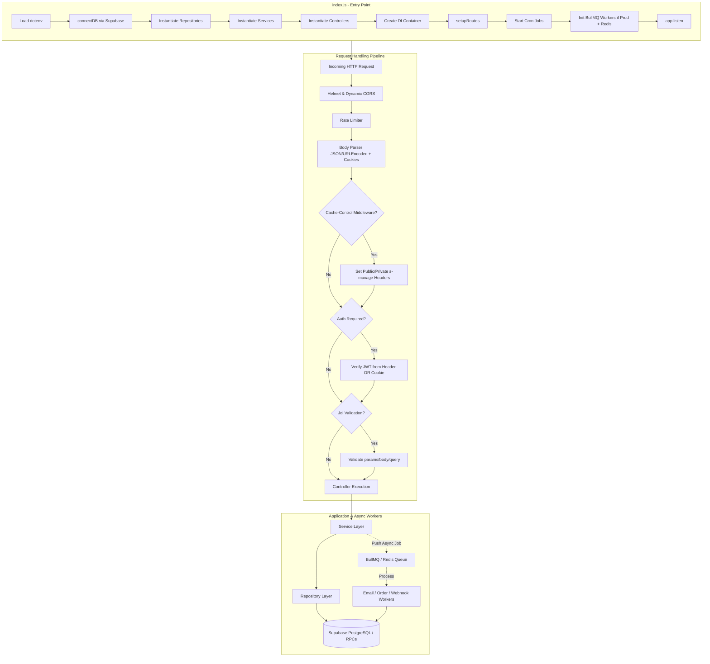
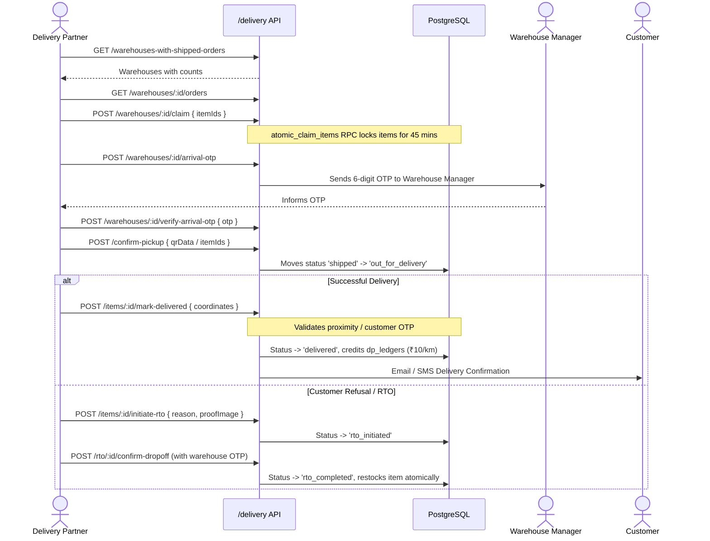

# Bukizz Node Server — Complete Context Document

## 1. Project Overview

**Bukizz** is a **school e-commerce platform** API backend. It enables parents/students to purchase school supplies (books, uniforms, stationery) online, organized by school and grade. The platform supports four user roles: **Customer**, **Retailer**, **Admin**, and **Delivery Partner (DP)**.

| Attribute | Value |
|---|---|
| **Runtime** | Node.js ≥ 18 (ES Modules) |
| **Framework** | Express 4.18 |
| **Database** | Supabase (PostgreSQL) |
| **Auth** | JWT (Header + httpOnly Cookies) + Supabase Auth (Google OAuth) + Apple OAuth + Email OTP + DP PIN Auth (`auth_provider: 'dp_pin'`) |
| **Payments** | Razorpay (orders, webhooks, payment links, penny-drop bank verification) |
| **Queues / Background Jobs** | BullMQ + Redis (Upstash / Local Redis) with automatic inline fallback if Redis is unconfigured or in development |
| **Validation** | Joi (~2350 lines in `src/models/schemas.js`) |
| **File Uploads** | Multer (memory storage → Supabase Storage) |
| **Image Processing** | Sharp (WebP conversion and image optimization scripts) |
| **Logging** | Winston (file + console) with request correlation IDs |
| **Security** | Helmet, CORS (with credentials & dynamic IP matching), express-rate-limit, bcryptjs, AES-256-GCM encryption |
| **Caching / Egress Control**| Route-level `Cache-Control` middleware (catalog, details, static, private) to reduce Supabase egress bandwidth costs |
| **Email** | Nodemailer (SMTP / direct service fallback) with HTML templates (OTP, order confirmation with delivery time estimates, retailer notifications, delivery confirmations, return/refund updates, password resets, admin query alerts) |
| **SMS** | MSG91 Flow API (order confirmation, delivery notification, OTPs) |
| **Cron Jobs** | node-cron (daily sitemap generation) |
| **Containerization** | Docker + docker-compose |

---

## 2. Local Setup & Onboarding

### Prerequisites
- Node.js (≥ 18)
- PostgreSQL / Supabase locally or hosted
- Redis instance (optional in development; Upstash Redis or local Redis for BullMQ background workers)
- Docker & docker-compose (optional, for running dependencies locally)

### Step-by-Step Setup
1. **Clone & Install:**
   ```bash
   cd Bukizz/server
   npm install
   ```
2. **Environment Variables:**
   Copy `.env.example` to `.env` and fill in the required values (refer to section 14 for variables).
   ```bash
   cp .env.example .env
   ```
3. **Database Setup:**
   - Create a project in Supabase (or run locally).
   - Execute `src/db/schema.sql` to initialize core tables, types, triggers, and RPCs.
   - Run migrations from `src/db/` (specifically `migration_create_delivery_partner_data.sql`, `migration_add_soft_lock_to_items.sql`, `migration_return_flow.sql`, `migration_create_variant_addons.sql`, `migration_add_city_sort_to_schools.sql`, and `migrations/atomic_functions.sql`).
   - (Optional) Run `src/db/init.sql` to populate sample data.
4. **Run the Development Server:**
   ```bash
   npm run dev
   ```
   The server will start on `http://localhost:3001` (or your configured `PORT`).
   *Note: In development mode (`NODE_ENV !== "production"`), queue workers are skipped and email/order/webhook operations fall back directly to inline processing unless Redis workers are explicitly booted.*

---

## 3. Folder Structure

```
bukizz_node_server/
├── index.js                    # Main entry point — boots server, wires DI, legacy auth routes, cron & queue workers
├── package.json                # Dependencies & scripts
├── Dockerfile                  # Docker image config
├── docker-compose.yml          # Multi-service orchestration
├── healthcheck.js              # Container health check
├── .env / .env.example         # Environment variables
├── nodemon.json                # Dev server config
├── postman.json                # Postman collection
├── public/
│   └── sitemap.xml             # Auto-generated sitemap (served statically)
├── scripts/
│   ├── apply_school_sorting_migration.js  # Runs city_code & sort_order migration on schools
│   ├── backfill_schools_sort.js           # Backfills school sort order & city codes
│   ├── backfillWarehouseIds.js            # Associates legacy records with warehouses
│   ├── migrate_bank_accounts.js           # Encrypts and migrates legacy bank details
│   ├── optimize_categories_images.js      # Sharp-based image optimization for category assets
│   ├── optimize_products_images.js        # Sharp-based image optimization for product catalog
│   ├── test_banners_logic.js              # Banner filter unit test verification
│   ├── testCategoryApi.js                 # Category API integration tests
│   ├── testOrderApi.js                    # Order API integration tests
│   ├── testSchoolApi.js                   # School API integration tests
│   ├── verify_category_attributes.js      # Schema attribute validation check
│   └── verifySalesCalc.js                 # Ledger revenue audit tool
└── src/
    ├── app.js                  # Alternative entry point (CJS compatibility)
    ├── config/
    │   ├── index.js            # Centralized config (env vars, CORS, JWT, DB, uploads, encryption)
    │   └── dependencies.js     # DI container factory (Repository → Service → Controller)
    ├── db/
    │   ├── index.js            # Supabase client init, query helpers, RPC helpers
    │   ├── schema.sql          # Full core DDL — tables, types, indexes, triggers, RPC functions
    │   ├── init.sql            # Sample seed data for development/testing
    │   ├── sample_variant_data.sql
    │   ├── functions/
    │   │   └── create_comprehensive_product.sql  # RPC for atomic product creation
    │   ├── migrations/
    │   │   └── atomic_functions.sql              # Concurrency & race-condition guard RPCs
    │   └── (19+ migration scripts)               # See § 6.4 Migration Summary
    ├── jobs/
    │   └── cronJobs.js         # Cron scheduler — daily sitemap generation + startup run
    ├── middleware/
    │   ├── index.js            # setupMiddleware() — helmet, cors, compression, rate limit
    │   ├── authMiddleware.js   # authenticateToken (header+cookie), optionalAuth, requireRoles, requireOwnership
    │   ├── cacheControl.js     # Route caching middleware (catalog, details, static, private)
    │   ├── errorHandler.js     # AppError class, errorHandler, notFoundHandler, asyncHandler
    │   ├── rateLimiter.js      # Global, auth, OTP send/verify, and order rate limiters
    │   ├── upload.js           # Multer config (memory storage, image filters)
    │   └── validator.js        # Joi validate() middleware, form data preprocessing, sanitizer
    ├── models/
    │   └── schemas.js          # ALL Joi validation schemas (~2350 lines)
    ├── queue/                  # BullMQ message queues
    │   ├── connection.js       # Redis / Upstash connection factory & graceful fallback detector
    │   ├── emailQueue.js       # Email dispatch queue + direct inline fallback
    │   ├── orderQueue.js       # Post-order delivery & cancellation background tasks
    │   └── webhookQueue.js     # Idempotent background Razorpay webhook ingestion
    ├── workers/                # BullMQ worker consumers (production)
    │   ├── emailWorker.js      # Processes queued email jobs
    │   ├── orderWorker.js      # Processes post-order delivery/restock tasks
    │   └── webhookWorker.js    # Processes payment captured/failed events
    ├── templates/              # HTML email templates
    │   ├── forgot-password.html
    │   ├── order-confirmation-customer.html
    │   ├── order-delivery-customer.html
    │   ├── order-notification-retailer.html
    │   ├── refund-processed-customer.html
    │   ├── return-picked-up-customer.html
    │   ├── return-request-approved.html
    │   ├── rto-initiated-customer.html
    │   └── user-query-admin.html
    ├── controllers/            # Request handling layer — 20 controllers
    │   ├── authController.js
    │   ├── bannerController.js             # Public & Admin promotional banner management
    │   ├── brandController.js
    │   ├── categoryController.js
    │   ├── dashboardController.js          # Retailer dashboard aggregated overview
    │   ├── deliveryController.js           # Delivery Partner operational endpoints (claims, OTP, RTO, COD)
    │   ├── dpAdminController.js            # DP Administration hub, loadouts, force-unassign, payouts
    │   ├── imageController.js
    │   ├── orderController.js              # Order placement, tracking, customer returns & support tickets
    │   ├── paymentController.js            # Razorpay order create/verify/webhook/reconcile
    │   ├── pincodeController.js            # Pincode check & bulk import
    │   ├── productController.js            # Product catalog, variants, addons, commissions
    │   ├── retailerBankAccountController.js # Bank account CRUD + Razorpay penny drop
    │   ├── retailerController.js
    │   ├── retailerOrderController.js      # Warehouse-scoped order filters & status transitions
    │   ├── retailerSchoolController.js
    │   ├── schoolController.js             # School search, catalog, sort orders, image uploads
    │   ├── settlementController.js         # Retailer settlements, ledgers, payouts
    │   ├── userController.js               # Customer profile, addresses, admin user & retailer approvals
    │   └── warehouseController.js
    ├── services/               # Business logic layer — 18 services
    │   ├── authService.js                  # Customers, Retailers, DP PIN auth, Apple OAuth, deletion
    │   ├── categoryService.js
    │   ├── deliveryBankService.js          # DP bank verification & masked account storage
    │   ├── deliveryIncentiveService.js     # ₹10/km DP incentive calculation with distance fallbacks
    │   ├── dpAdminService.js               # DP hub list, SLA computation, force-unassign, atomic payouts
    │   ├── emailService.js                 # Dispatches HTML emails, dynamic delivery estimates
    │   ├── imageService.js
    │   ├── orderService.js                 # Commission calculation, stock reservation, deferred notifications
    │   ├── productService.js               # Products, variants, add-ons, metadata deliveryHours
    │   ├── razorpayVerificationService.js  # Bank account penny drop via Razorpay FAV API
    │   ├── retailerBankAccountService.js   # Bank account business logic (AES encryption)
    │   ├── retailerSchoolService.js
    │   ├── retailerService.js
    │   ├── schoolService.js                # School catalog, sort orders, cover images
    │   ├── settlementService.js            # Retailer FIFO partial settlement algorithm
    │   ├── smsService.js                   # MSG91 Flow API integration
    │   ├── userService.js
    │   └── warehouseService.js
    ├── repositories/           # Data access layer — 24 repositories
    │   ├── brandRepository.js
    │   ├── categoryRepository.js
    │   ├── deliveryRepository.js           # DP bank details, cash-in-hand delivered COD orders, remittances
    │   ├── dpAdminRepository.js            # DP hub list, loadouts, unassignment, audit logs
    │   ├── dpLedgerRepository.js           # dp_ledgers CRUD, balance calculation, transaction logs
    │   ├── ledgerRepository.js             # seller_ledgers CRUD, FIFO queries, dashboard metrics
    │   ├── orderEventRepository.js
    │   ├── orderQueryRepository.js         # Support tickets, threads, admin replies
    │   ├── orderRepository.js              # Orders, items, atomic soft locks, warehouse item views
    │   ├── otpRepository.js
    │   ├── pincodeRepository.js
    │   ├── productImageRepository.js
    │   ├── productOptionRepository.js
    │   ├── productPaymentMethodRepository.js
    │   ├── productRepository.js
    │   ├── productVariantRepository.js
    │   ├── retailerBankAccountRepository.js
    │   ├── retailerRepository.js
    │   ├── retailerSchoolRepository.js
    │   ├── schoolRepository.js
    │   ├── settlementRepository.js
    │   ├── userRepository.js
    │   ├── variantCommissionRepository.js
    │   └── warehouseRepository.js
    ├── routes/                 # Route definitions — 22 files
    │   ├── index.js                        # Master router — mounts all modules under /api/v1
    │   ├── adminDeliveryRoutes.js          # /api/v1/admin/delivery
    │   ├── authRoutes.js                   # /api/v1/auth
    │   ├── bannerRoutes.js                 # /api/v1/banners
    │   ├── brandRoutes.js                  # /api/v1/brands
    │   ├── categoryRoutes.js               # /api/v1/categories
    │   ├── deliveryAuthRoutes.js           # /api/v1/delivery/auth
    │   ├── deliveryRoutes.js               # /api/v1/delivery
    │   ├── dpAdminRoutes.js                # /api/v1/admin/delivery-partners
    │   ├── imageRoutes.js                  # /api/v1/images
    │   ├── orderRoutes.js                  # /api/v1/orders
    │   ├── paymentRoutes.js                # /api/v1/payments
    │   ├── pincodeRoutes.js                # /api/v1/pincodes
    │   ├── productRoutes.js                # /api/v1/products
    │   ├── retailerBankAccountRoutes.js    # /api/v1/retailer/bank-accounts
    │   ├── retailerOrderRoutes.js          # /api/v1/retailer/orders
    │   ├── retailerRoutes.js               # /api/v1/retailer
    │   ├── retailerSchoolRoutes.js         # /api/v1/retailer-schools
    │   ├── schoolRoutes.js                 # /api/v1/schools
    │   ├── settlementRoutes.js             # /api/v1/settlements
    │   ├── userRoutes.js                   # /api/v1/users
    │   └── warehouseRoutes.js              # /api/v1/warehouses
    └── utils/
        ├── distanceCalc.js                 # Haversine formula + geocoding/pincode fallback chain
        ├── encryption.js                   # AES-256-GCM encrypt/decrypt, maskAccountNumber
        ├── logger.js                       # Winston logger with correlation IDs
        └── sitemapGenerator.js            # Dynamic XML sitemap generator
```

---

## 4. Architecture Pattern


```mermaid
graph TD
    subgraph Boot [index.js - Entry Point]
        A[Load dotenv] --> B[connectDB via Supabase]
        B --> C[Instantiate Repositories]
        C --> D[Instantiate Services]
        D --> E[Instantiate Controllers]
        E --> F[Create DI Container]
        F --> G[setupRoutes]
        G --> H[Start Cron Jobs]
        H --> I[Init BullMQ Workers if Prod + Redis]
        I --> J[app.listen]
    end

    subgraph Pipeline [Request Handling Pipeline]
        Req[Incoming HTTP Request] --> M1[Helmet & Dynamic CORS]
        M1 --> M2[Rate Limiter]
        M2 --> M3[Body Parser JSON/URLEncoded + Cookies]
        M3 --> Caching{Cache-Control Middleware?}
        Caching -- Yes --> SetHeaders[Set Public/Private s-maxage Headers]
        Caching -- No --> Auth{Auth Required?}
        SetHeaders --> Auth
        Auth -- Yes --> AuthVerify[Verify JWT from Header OR Cookie]
        Auth -- No --> Val
        AuthVerify --> Val{Joi Validation?}
        Val -- Yes --> Schema[Validate params/body/query]
        Val -- No --> Exec[Controller Execution]
        Schema --> Exec
    end

    subgraph Business [Application & Async Workers]
        Exec --> Srv[Service Layer]
        Srv --> Repo[Repository Layer]
        Repo --> DB[(Supabase PostgreSQL / RPCs)]
        Srv -. Push Async Job .-> Queue[BullMQ / Redis Queue]
        Queue -. Process .-> Workers[Email / Order / Webhook Workers]
        Workers --> DB
    end

    Boot --> Req
```

### Auth Middleware Details

| Middleware | Purpose |
|---|---|
| `authenticateToken` | Extracts Bearer token from `Authorization` header **or** `accessToken` from `req.cookies`. Verifies token via `authService.verifyToken()`, attaches `req.user`, `req.tokenData`, and raw `req.token`. |
| `optionalAuth` | Same check as above from header or cookie, but proceeds without blocking if no token is present. |
| `requireRoles(...roles)` | Checks `req.user.roles` against allowed roles (`customer`, `retailer`, `admin`, `delivery_partner`, `system`). |
| `requireOwnership(paramName)` | Ensures users only access resources belonging to their own `userId`. |
| `requireVerification` | Blocks access for unverified email accounts. |
| `requireActiveUser` | Blocks deactivated accounts (`is_active = false`). |

### Rate Limiting

| Context | Window | Max Requests |
|---|---|---|
| **Global** | 15 min | 1000 |
| **Auth Operations** | 15 min | 30 |
| **OTP Send** | 5 min | 3 |
| **OTP Verify** | 5 min | 5 |
| **Order Creation** | 15 min | 20 |
| **Order Queries** | 1 min | 60 |
| **Retailer Order Queries** | 1 min | 60 |

### Caching Middleware (`cacheControl.js`)
To minimize Supabase database queries and reduce egress bandwidth costs, cache headers are attached to public GET routes:
- `cacheMiddleware.catalog`: 120s `public, max-age=120, s-maxage=120` (product listings, school search)
- `cacheMiddleware.details`: 60s `public, max-age=60, s-maxage=60` (product detail, school detail, similar products)
- `cacheMiddleware.static`: 3600s (categories, brands, school stats)
- `cacheMiddleware.private`: `private, no-store, no-cache, must-revalidate` (cart, orders, wallet)

---

## 5. Complete Route Map

All routes are mounted under **`/api/v1`**.

### 5.1 Auth Routes — `/api/v1/auth`

| Method | Path | Auth | Description |
|---|---|---|---|
| POST | `/register` | ❌ | Register new customer |
| POST | `/login` | ❌ | Login (supports `loginAs: customer/retailer/admin`). Sets httpOnly cookies (`accessToken`, `refreshToken`) |
| POST | `/login-retailer` | ❌ | Login as retailer |
| POST | `/register-retailer` | ❌ | Register retailer (inactive/unauthorized until approved) |
| POST | `/send-otp` | ❌ | Send OTP for customer registration |
| POST | `/verify-otp` | ❌ | Verify OTP, complete customer registration |
| POST | `/send-retailer-otp` | ❌ | Send OTP for retailer registration |
| POST | `/verify-retailer-otp` | ❌ | Verify retailer OTP, create inactive account |
| POST | `/refresh-token` | ❌ | Refresh JWT token (checks body or cookie) |
| POST | `/forgot-password` | ❌ | Request password reset email |
| POST | `/reset-password` | ❌ | Reset password with token |
| POST | `/google-login` | ❌ | Google OAuth login via Supabase Auth token |
| POST | `/apple-login` | ❌ | Apple OAuth login (decodes ID token, provisions user) |
| POST | `/verify-token` | ❌ | Verify validity of current JWT |
| PUT | `/verify-retailer` | ✅ (Admin) | Authorize or deauthorize retailer |
| GET | `/me` | ✅ | Get profile of currently authenticated user |
| POST | `/logout` | ✅ | Revoke refresh tokens, clear auth cookies |
| DELETE | `/delete-account` | ✅ | Delete/anonymize user account and revoke auth credentials |

---

### 5.2 User Routes — `/api/v1/users`

| Method | Path | Auth | Role | Description |
|---|---|---|---|---|
| POST | `/verify-email/confirm` | ❌ | — | Confirm email verification link |
| GET | `/profile` | ✅ | Any | Get user profile |
| PUT | `/profile` | ✅ | Any | Update user profile |
| GET | `/addresses` | ✅ | Any | List saved addresses |
| POST | `/addresses` | ✅ | Any | Add new address (supports `studentName`, `landmark`, `district`) |
| PUT | `/addresses/:addressId` | ✅ | Any | Update saved address |
| DELETE | `/addresses/:addressId` | ✅ | Any | Delete saved address |
| GET | `/preferences` | ✅ | Any | Get user preferences |
| PUT | `/preferences` | ✅ | Any | Update preferences |
| GET | `/stats` | ✅ | Any | Get user order/activity statistics |
| DELETE | `/account` | ✅ | Any | Deactivate own account |
| POST | `/verify-email` | ✅ | Any | Send verification email |
| POST | `/verify-phone` | ✅ | Any | Verify phone number |
| **Admin Operations** | | | | |
| GET | `/admin/search` | ✅ | Admin | Search users |
| GET | `/admin/export` | ✅ | Admin | Export user records |
| GET | `/admin/:userId` | ✅ | Admin | Get user by ID |
| PUT | `/admin/:userId` | ✅ | Admin | Update user by admin |
| PUT | `/admin/:userId/role` | ✅ | Admin | Change user role |
| POST | `/admin/:userId/reactivate` | ✅ | Admin | Reactivate account |
| GET | `/admin/retailers/pending` | ✅ | Admin | List pending retailer accounts awaiting approval |
| PATCH | `/admin/retailers/:userId/approve` | ✅ | Admin | Approve pending retailer account |

---

### 5.3 Product Routes — `/api/v1/products`

**Public Endpoints (Cached with Cache-Control):**

| Method | Path | Description |
|---|---|---|
| GET | `/` | Search/list products (paginated, filtered, cached) |
| GET | `/retailer-search` | Search products by retailer name |
| GET | `/featured` | Get featured products |
| GET | `/stats` | Product statistics |
| GET | `/variants/search` | Search across product variants |
| GET | `/variants/:variantId` | Get variant details by ID |
| GET | `/category/:categorySlug` | Products filtered by category slug |
| GET | `/brand/:brandId` | Products filtered by brand |
| GET | `/type/:productType` | Products filtered by type (`bookset`, `uniform`, `stationary`, `general`) |
| GET | `/school/:schoolId` | Products associated with a school |
| GET | `/:id/similar` | Get similar products based on school, grade, and category |
| GET | `/:id` | Get product by ID |
| GET | `/:id/comprehensive` | Product with options, values, variants, images, payment methods |
| GET | `/:id/complete` | Complete product details with images, brands, and retailer data |
| GET | `/:id/analytics` | Product sales analytics |
| GET | `/:id/availability` | Product and variant stock availability check |
| GET | `/:id/options` | Product option attributes & values |
| GET | `/:id/variants` | All variants of product |
| GET | `/:id/images` | Product and variant images |
| GET | `/variants/:variantId/images` | Variant-specific images |
| GET | `/:id/brands` | Associated brands |

**Protected Endpoints (Retailer / Admin):**

| Method | Path | Description |
|---|---|---|
| GET | `/warehouse` | Products for warehouse (`x-warehouse-id` header required) |
| GET | `/warehouse/low-stock` | Low-stock products for warehouse (`x-warehouse-id` header required, threshold filter) |
| GET | `/admin/search` | Admin product search (includes inactive and soft-deleted) |
| POST | `/` | Create product (supports `paymentMethods`, `deliveryHours` in metadata) |
| POST | `/comprehensive` | Create product atomically via RPC |
| POST | `/addon/comprehensive` | Create product as an add-on bundle item atomically |
| PUT | `/:id` | Update product |
| PUT | `/:id/comprehensive` | Update comprehensive product atomically |
| DELETE | `/:id` | Soft delete product (`is_deleted = true`) |
| PATCH | `/:id/activate` | Reactivate soft-deleted product |
| PUT | `/bulk-update` | Bulk update product attributes |
| **Options & Values** | | |
| POST | `/:id/options` | Add option attribute (e.g., Size, Color) |
| POST | `/options/:attributeId/values` | Add option value (`price_modifier`, `image_url`) |
| PUT | `/options/:attributeId` | Update option attribute |
| PUT | `/options/values/:valueId` | Update option value |
| DELETE | `/options/:attributeId` | Delete option attribute |
| DELETE | `/options/values/:valueId` | Delete option value |
| **Variants & Stock** | | |
| POST | `/:id/variants` | Create variant |
| PUT | `/variants/:variantId` | Update variant |
| DELETE | `/variants/:variantId` | Delete variant |
| PATCH | `/variants/:variantId/stock` | Update variant stock count |
| PUT | `/variants/bulk-stock-update` | Bulk update variant stock counts |
| **Variant Add-ons** | | |
| POST | `/:id/variants/:variantId/addons` | Attach an add-on product/variant to parent variant |
| DELETE | `/:id/variants/:variantId/addons/:addonId` | Detach an add-on |
| **Commissions** | | |
| GET | `/:id/commissions` | Get active commissions for all product variants |
| PUT | `/commissions/bulk` | Bulk set variant commissions |
| **Images & Brands** | | |
| POST | `/:id/images` | Upload/add product image |
| POST | `/:id/images/bulk` | Add multiple product images |
| PUT | `/images/:imageId` | Update image metadata |
| DELETE | `/images/:imageId` | Delete product image |
| PATCH | `/:id/images/:imageId/primary` | Mark image as primary |
| POST | `/:id/variants/images/bulk` | Bulk upload variant-specific images |
| POST | `/:id/brands` | Associate brand with product |
| DELETE | `/:id/brands/:brandId` | Remove brand association |
| POST | `/:id/retailer` | Attach retailer details |
| PUT | `/:id/retailer` | Update retailer details |
| DELETE | `/:id/retailer` | Remove retailer details |

---

### 5.4 Category Routes — `/api/v1/categories`

| Method | Path | Auth | Description |
|---|---|---|---|
| GET | `/` | ❌ | List categories (supports `parentId`, `rootOnly`, `schoolCat`; cached) |
| GET | `/:id` | ❌ | Get category by ID |
| POST | `/` | ✅ | Create category (with image upload) |
| PUT | `/:id` | ✅ | Update category |
| DELETE | `/:id` | ✅ | Delete category |

---

### 5.5 Brand Routes — `/api/v1/brands`

| Method | Path | Auth | Description |
|---|---|---|---|
| GET | `/` | ❌ | List brands |
| GET | `/:id` | ❌ | Get brand by ID |
| POST | `/` | ✅ | Create brand |
| PUT | `/:id` | ✅ | Update brand |
| DELETE | `/:id` | ✅ | Delete brand |

---

### 5.6 School Routes — `/api/v1/schools`

| Method | Path | Auth | Description |
|---|---|---|---|
| GET | `/` | ❌ | Search schools (city, state, type, board, sort_order; cached) |
| GET | `/stats` | ❌ | School statistics |
| GET | `/popular` | ❌ | Popular schools |
| GET | `/nearby` | ❌ | Nearby schools (lat/lng/radius) |
| POST | `/validate` | ❌ | Validate school record |
| GET | `/city/:city` | ❌ | Schools by city |
| GET | `/:id` | ❌ / opt | School details (enriched with board & student counts) |
| GET | `/:id/analytics` | ❌ | School analytics |
| GET | `/:id/catalog` | ❌ | Product catalog for school |
| POST | `/` | ✅ | Create school (with `image` and `cover_image` uploads) |
| PUT | `/sort-order` | ✅ | Bulk update school sort orders (`updateSortOrders` schema) |
| PUT | `/:id` | ✅ | Update school (supports cover image upload) |
| DELETE | `/:id` | ✅ | Soft delete school |
| PATCH | `/:id/reactivate` | ✅ | Reactivate school |
| POST | `/bulk-import` | ✅ | Bulk import schools from CSV |
| POST | `/upload-image` | ✅ | Upload school image |
| POST | `/:schoolId/products/:productId` | ✅ | Associate product with school (grade + mandatory flag) |
| PUT | `/:schoolId/products/:productId/:grade` | ✅ | Update product association |
| DELETE | `/:schoolId/products/:productId` | ✅ | Remove product association |
| POST | `/:id/partnerships` | ✅ | Create school partnership record |

---

### 5.7 Order Routes — `/api/v1/orders`

All order routes require authentication.

**Customer Self-Service:**

| Method | Path | Description |
|---|---|---|
| POST | `/` | Place order (validates stock, calculates fees, atomic transaction) |
| POST | `/place` | Place order (alias) |
| POST | `/calculate-summary` | Cart checkout calculation preview |
| GET | `/my-orders` | List current customer orders |
| GET | `/:orderId` | Order details |
| GET | `/:orderId/track` | Track order delivery status and milestones |
| PUT | `/:orderId/cancel` | Cancel entire order (restocks inventory) |
| PUT | `/:orderId/items/:itemId/cancel` | Cancel specific item in order |
| POST | `/:orderId/items/:itemId/request-return` | Request return for a delivered order item |
| POST | `/:orderId/queries` | Create support ticket / query for order |
| GET | `/:orderId/queries` | Get support tickets for order |

**Admin Customer Support / Query Threads:**

| Method | Path | Roles | Description |
|---|---|---|---|
| GET | `/admin/queries` | Admin | List all customer order queries / tickets |
| GET | `/admin/queries/:queryId` | Admin | Detailed view of support query thread |
| POST | `/admin/queries/:queryId/reply` | Admin | Add admin response to ticket thread |
| PUT | `/admin/queries/:queryId/status` | Admin | Update query status (`open`, `pending`, `resolved`, `closed`) |

**Admin / Retailer Operations:**

| Method | Path | Roles | Description |
|---|---|---|---|
| GET | `/warehouse/items/:itemId` | Admin, Retailer | Get single order item details for warehouse |
| GET | `/admin/search` | Admin, Retailer | Search and filter orders (supports status, city, date) |
| GET | `/admin/status/:status` | Admin, Retailer | Orders filtered by status |
| PUT | `/:orderId/status` | Admin, Retailer | Update overall order status |
| PUT | `/:orderId/items/:itemId/status` | Admin, Retailer | Update item status (triggers milestone notifications) |
| PUT | `/:orderId/payment` | Admin, System | Update payment status |
| PUT | `/admin/bulk-update` | Admin | Bulk update orders |
| GET | `/admin/export` | Admin | Export order dataset |
| GET | `/admin/statistics` | Admin, Retailer | Order analytics and revenue metrics |

**Order Status Enum Values:**
`initialized` → `processed` → `shipped` → `out_for_delivery` → `delivered`
*Terminal / Exception Statuses:* `cancelled`, `refunded`, `returned`, `rto_initiated`, `rto_in_transit`, `rto_completed`, `return_requested`, `return_pickup_assigned`, `return_in_transit`

---

### 5.8 Retailer Order Routes — `/api/v1/retailer/orders`

All endpoints require auth + `retailer` or `admin` role. Rate limited: 60 req/min.

| Method | Path | Description |
|---|---|---|
| GET | `/stats` | Aggregated order metrics across all retailer warehouses |
| GET | `/warehouse/:warehouseId/stats` | Order statistics for specific warehouse |
| GET | `/warehouse/:warehouseId/status/:status` | Orders by status for warehouse |
| POST | `/warehouse/:warehouseId/filter` | Advanced filtered query (product type, school, student name, dates) |
| GET | `/warehouse/:warehouseId/filter-options/schools` | Unique schools for filter dropdown |
| GET | `/warehouse/:warehouseId/filter-options/products` | Unique products for filter dropdown |
| GET | `/warehouse/:warehouseId/filter-options/statuses` | Unique item statuses for filter dropdown |
| GET | `/warehouse/:warehouseId` | Orders for warehouse (paginated, searchable) |
| PUT | `/:orderId/items/:itemId/status` | Update warehouse order item status |
| PUT | `/:orderId/status` | Update warehouse order status |
| GET | `/:orderId` | Order detail (bifurcated: retailer sees only their items) |
| GET | `/` | All orders across all warehouses for retailer |

---

### 5.9 Payment Routes — `/api/v1/payments`

| Method | Path | Auth | Description |
|---|---|---|---|
| POST | `/webhook` | ❌ | Razorpay webhook. Ingested via BullMQ `webhookQueue` (idempotent deduplication via `processed_webhooks`) with inline fallback |
| POST | `/create-order` | ✅ | Create Razorpay order |
| POST | `/verify` | ✅ | Verify signature, mark payment `paid`, trigger deferred notifications |
| POST | `/reconcile` | ✅ | Reconcile payment when money was deducted but client verification dropped |
| POST | `/failure` | ✅ | Log payment failure |

---

### 5.10 Delivery Partner Auth Routes — `/api/v1/delivery/auth`

| Method | Path | Auth | Description |
|---|---|---|---|
| POST | `/register` | ❌ | Register new DP with documents (profile photo, Aadhaar, PAN, DL). Creates inactive account |
| POST | `/login` | ❌ | Login using phone number + 6-digit PIN |
| POST | `/resend-pin` | ❌ | Resend / regenerate PIN sent via SMS |

---

### 5.11 Delivery Partner Operations Routes — `/api/v1/delivery`

All routes require authentication with `delivery_partner` role.

| Method | Path | Description |
|---|---|---|
| GET | `/warehouses-with-shipped-orders` | List warehouses having packages ready to be picked up |
| GET | `/warehouses/:warehouseId/orders` | Available shipped items for warehouse (excluding items soft-locked by other DPs) |
| POST | `/warehouses/:warehouseId/claim` | Claim (soft-lock) items for 45 minutes via `atomic_claim_items` RPC |
| GET | `/my-claimed-orders` | Current partner's claimed orders (powers active scan timer on app) |
| POST | `/warehouses/:warehouseId/arrival-otp` | Send OTP to warehouse manager upon DP arrival |
| POST | `/warehouses/:warehouseId/verify-arrival-otp` | Verify warehouse arrival OTP |
| POST | `/confirm-pickup` | Confirm package pickup after QR scan (moves status `shipped` → `out_for_delivery`) |
| GET | `/active-deliveries` | Active packages out for delivery by the DP |
| POST | `/items/:itemId/mark-delivered` | Mark package delivered (validates distance / coordinates, credits DP ledger) |
| POST | `/items/:itemId/delivery-otp` | Send delivery OTP to customer if DP is away from destination |
| POST | `/items/:itemId/verify-delivery-otp` | Verify OTP to complete delivery when GPS is overridden |
| POST | `/items/:itemId/rto-otp` | Send OTP if customer refuses delivery (RTO verification) |
| POST | `/items/:itemId/verify-rto-otp` | Verify customer refusal OTP |
| POST | `/create-payment-link` | Create Razorpay UPI/card payment link for COD collections |
| GET | `/payment-status/:orderId` | Poll payment status of on-the-spot COD payment link |
| GET | `/wallet/balance` | DP wallet balance and recent earning transactions from `dp_ledgers` |
| GET | `/history` | Completed delivery history |
| POST | `/bank-details` | Add DP bank details for payouts (validates IFSC, stores masked number) |
| GET | `/bank-details` | Get saved DP bank details |
| **RTO (Return to Origin)** | | |
| POST | `/items/:itemId/initiate-rto` | Initiate RTO when delivery fails (records reason & proof image) |
| GET | `/rto-items` | Packages in possession of DP pending return to warehouse |
| POST | `/rto/:returnId/dropoff-otp` | Send OTP to warehouse manager for RTO dropoff |
| POST | `/rto/:returnId/verify-dropoff-otp` | Verify warehouse manager OTP for RTO return |
| POST | `/rto/:returnId/confirm-dropoff` | Confirm package returned to warehouse (restocks item) |
| **Customer Return Pickups** | | |
| GET | `/return-pickups` | Available customer-requested return packages |
| POST | `/return-pickups/:returnId/claim` | Claim customer return pickup |
| POST | `/return-pickups/:returnId/confirm-pickup` | Confirm item picked up from customer doorstep |
| POST | `/return-pickups/:returnId/confirm-dropoff` | Confirm return item dropped at warehouse (triggers customer refund) |
| **Cash-In-Hand & Remittance** | | |
| GET | `/cash/balance` | Unremitted COD cash collected in hand |
| POST | `/cash/submit` | Submit cash deposit remittance request to admin |

---

### 5.12 Admin Delivery Partner Module — `/api/v1/admin/delivery-partners` & `/admin/delivery`

All routes require auth + `admin` role.

| Method | Path | Description |
|---|---|---|
| GET | `/api/v1/admin/delivery/pending` | List pending delivery partner applications |
| PUT | `/api/v1/admin/delivery/partners/:id/approve` | Approve DP application, generate 6-digit PIN, send welcome email/SMS |
| POST | `/api/v1/admin/delivery/return-pickups/:returnId/assign` | Assign customer return pickup to specific DP |
| GET | `/api/v1/admin/delivery-partners` | Hub List: all DPs with computed status (`Idle`, `In-Transit`, `Inactive`) & cash limit alert flags |
| GET | `/api/v1/admin/delivery-partners/:id` | Full DP details: profile, vehicle, KYC documents, bank, active orders |
| GET | `/api/v1/admin/delivery-partners/:id/active-loadout` | Real-time active orders with SLA timer (warning triggered if order > 4 hours in-transit) |
| POST | `/api/v1/admin/delivery-partners/:id/unassign` | Force-unassign order from DP with audit reason log |
| GET | `/api/v1/admin/delivery-partners/:id/ledger` | DP earnings ledger with descending running balance calculation |
| GET | `/api/v1/admin/delivery-partners/:id/history` | Historical completed deliveries |
| POST | `/api/v1/admin/delivery-partners/:id/payout` | Execute DP wallet payout atomically via `atomic_wallet_payout` RPC |
| PATCH | `/api/v1/admin/delivery-partners/:id/cod-status` | Toggle COD cash handling eligibility |
| GET | `/api/v1/admin/delivery-partners/cash/remittances` | List cash remittances submitted by DPs |
| POST | `/api/v1/admin/delivery-partners/cash/remittances/:id/approve` | Approve cash remittance, deducts from DP cash-in-hand |

---

### 5.13 Promotional Banner Routes — `/api/v1/banners`

| Method | Path | Auth | Description |
|---|---|---|---|
| GET | `/public` | ❌ | Get active banners filtered by city and page (`cities @> [city]` or `'All'`) |
| GET | `/` | ✅ (Admin) | List all banners with admin filters |
| POST | `/` | ✅ (Admin) | Create banner (desktop/mobile image URLs, cities, pages, redirect URL, sort order) |
| PUT | `/:id` | ✅ (Admin) | Update banner |
| DELETE | `/:id` | ✅ (Admin) | Delete banner |

---

### 5.14 Retailer Profile & Dashboard — `/api/v1/retailer`

| Method | Path | Auth | Role | Description |
|---|---|---|---|---|
| GET | `/dashboard/overview` | ✅ | Retailer, Admin | Single aggregated dashboard overview (sales, active orders, low stock, schools, recent orders) |
| POST | `/data` | ✅ | Retailer | Create/update retailer business profile (GSTIN, PAN, signature) |
| PUT | `/data` | ✅ | Retailer | Update business profile |
| GET | `/data` | ✅ | Any auth | Get retailer profile |
| GET | `/data/status` | ✅ | Any auth | Check profile completeness |
| GET | `/verification-status` | ✅ | Any auth | Check approval status |

---

### 5.15 Retailer Bank Account Routes — `/api/v1/retailer/bank-accounts`

All routes require auth + `retailer` role.

| Method | Path | Description |
|---|---|---|
| POST | `/verify` | Penny drop bank account verification via Razorpay FAV |
| GET | `/` | List bank accounts (decrypted for owner) |
| POST | `/` | Add bank account (stored AES-256-GCM encrypted) |
| PUT | `/:id` | Update bank account |
| DELETE | `/:id` | Delete bank account |
| PATCH | `/:id/set-primary` | Set account as primary |

---

### 5.16 Retailer-School Connections — `/api/v1/retailer-schools`

| Method | Path | Auth | Description |
|---|---|---|---|
| POST | `/link` | ✅ | Link retailer warehouse to school |
| GET | `/connected-schools` | ✅ | Schools connected to authenticated retailer |
| GET | `/connected-schools/:retailerId` | ✅ | Schools for specific retailer |
| GET | `/connected-retailers/:schoolId` | ✅ | Retailers connected to school |
| PATCH | `/status` | ✅ | Update link status (`approved`, `pending`, `rejected`) |
| PATCH | `/product-type` | ✅ | Update authorized product types |
| DELETE | `/` | ✅ | Remove connection |

---

### 5.17 Settlement Routes — `/api/v1/settlements`

| Method | Path | Roles | Description |
|---|---|---|---|
| GET | `/summary` | Admin, Retailer | Dashboard financial summary (`x-warehouse-id` required) |
| GET | `/ledgers` | Admin, Retailer | Ledger history (paginated, filtered) |
| GET | `/` | Admin, Retailer | Payout history list |
| POST | `/adjustments` | Admin | Manual credit/debit adjustment row |
| POST | `/execute` | Admin | Execute FIFO settlement payout |
| GET | `/admin/retailers/:retailerId/summary` | Admin | Full financial summary for retailer |
| GET | `/admin/retailers/:retailerId/ledgers/unsettled`| Admin | Unsettled ledger entries |
| GET | `/admin/retailers/:retailerId/history` | Admin | Retailer payout history |
| POST | `/admin/execute` | Admin | Execute payout (flexible payment mode) |
| GET | `/retailer/ledgers` | Retailer | Retailer dashboard ledgers |
| GET | `/retailer/history` | Retailer | Payout list |
| GET | `/retailer/history/:settlementId` | Retailer | Settlement line-item breakdown |

---

### 5.18 Warehouse Routes — `/api/v1/warehouses`

| Method | Path | Role | Description |
|---|---|---|---|
| POST | `/` | Retailer, Admin | Add warehouse |
| POST | `/admin` | Admin | Add warehouse for retailer |
| GET | `/` | Retailer, Admin | Get my warehouses |
| GET | `/:id` | Retailer, Admin | Get warehouse by ID |
| GET | `/retailer/:retailerId` | Admin | Get warehouses for retailer |
| PUT | `/:id` | Retailer | Update own warehouse |
| PUT | `/admin/:id` | Admin | Update any warehouse |
| DELETE | `/:id` | Retailer | Soft delete own warehouse |
| DELETE | `/admin/:id` | Admin | Soft delete any warehouse |

---

### 5.19 Pincode & Image Routes

| Method | Path | Auth | Description |
|---|---|---|---|
| GET | `/api/v1/pincodes/check/:pincode` | ❌ | Check serviceability of pincode |
| POST | `/api/v1/pincodes/bulk` | ✅ | Bulk insert pincodes |
| POST | `/api/v1/images/upload` | ✅ | Upload image to Supabase Storage |
| DELETE | `/api/v1/images/delete` | ✅ | Delete image |
| PUT | `/api/v1/images/replace` | ✅ | Replace image |

---

## 6. Database Schema

### 6.1 Custom Types (ENUMs)

```sql
CREATE TYPE order_status AS ENUM (
  'initialized', 'processed', 'shipped', 'out_for_delivery', 'delivered',
  'cancelled', 'refunded', 'returned',
  'rto_initiated', 'rto_in_transit', 'rto_completed',
  'return_requested', 'return_pickup_assigned', 'return_in_transit'
);

CREATE TYPE payment_status AS ENUM ('pending', 'paid', 'failed', 'refunded');
CREATE TYPE product_type AS ENUM ('bookset', 'uniform', 'stationary', 'general');
CREATE TYPE auth_provider AS ENUM ('email', 'google', 'apple', 'dp_pin');
CREATE TYPE query_status AS ENUM ('open', 'pending', 'resolved', 'closed');
```

---

### 6.2 Key Tables

#### `users`
| Column | Type | Notes |
|---|---|---|
| id | UUID PK | Default `uuid_generate_v4()` |
| full_name | VARCHAR(255) | NOT NULL |
| email | VARCHAR(255) | NOT NULL UNIQUE |
| email_verified | BOOLEAN | Default FALSE |
| phone | VARCHAR(50) | |
| phone_verified | BOOLEAN | Default FALSE |
| role | VARCHAR(50) | `customer`, `retailer`, `admin`, `delivery_partner` |
| is_active | BOOLEAN | Default TRUE (Retailers and DPs start as FALSE pending approval) |
| deactivation_reason | TEXT | `'unauthorized'`, `'authorized'`, etc. |
| metadata | JSONB | |

#### `delivery_partner_data`
| Column | Type | Notes |
|---|---|---|
| id | UUID PK | |
| user_id | UUID FK→users | UNIQUE, ON DELETE CASCADE |
| profile_photo_url | TEXT | NOT NULL |
| vehicle_details | JSONB | `{ vehicleType, registrationNumber, drivingLicenseNumber }` |
| documents | JSONB | Aadhaar, PAN, DL image URLs |
| kyc_status | VARCHAR(20) | `pending`, `verified`, `rejected` |
| is_cod_eligible | BOOLEAN | Default FALSE |
| bank_account_name | VARCHAR(255) | |
| bank_account_number_masked | VARCHAR(20) | `********1234` |
| bank_ifsc | VARCHAR(11) | |
| razorpay_fund_account_id | VARCHAR(50) | RazorpayX Fund Account reference |
| bank_verification_status | VARCHAR(20) | Default `'pending'` |

#### `dp_ledgers`
| Column | Type | Notes |
|---|---|---|
| id | UUID PK | |
| dp_user_id | UUID FK→users | Delivery partner |
| order_id | UUID FK→orders | Associated order |
| return_id | UUID FK→order_returns| Associated return (if return pickup/RTO) |
| transaction_type | VARCHAR | `delivery_earning`, `payout`, `penalty`, `bonus` |
| amount | NUMERIC(10,2) | Positive for earnings, negative for payouts |
| description | TEXT | Reference / note |
| created_at | TIMESTAMPTZ | Default NOW() |

#### `dp_cash_remittances`
| Column | Type | Notes |
|---|---|---|
| id | UUID PK | |
| dp_id | UUID FK→users | Delivery partner |
| amount | NUMERIC(10,2) | Remitted amount |
| order_ids | UUID[] | Array of COD orders remitted |
| status | VARCHAR(20) | `pending`, `approved`, `rejected` |
| submitted_at | TIMESTAMPTZ | Default NOW() |
| approved_at | TIMESTAMPTZ | |
| approved_by | UUID FK→users | Admin who approved |

#### `order_returns`
| Column | Type | Notes |
|---|---|---|
| id | UUID PK | |
| order_id | UUID FK→orders | |
| order_item_id | UUID FK→order_items| Specific item being returned |
| return_type | VARCHAR(20) | `rto` (delivery failed) or `customer_return` |
| reason_code | VARCHAR(50) | Machine code (e.g. `CUSTOMER_UNAVAILABLE`, `WRONG_ITEM`) |
| reason_text | TEXT | Detailed notes |
| proof_image_url | TEXT | Uploaded photo |
| initiated_by | UUID FK→users | DP (for RTO) or Customer |
| pickup_dp_id | UUID FK→users | Assigned DP for return pickup |
| warehouse_id | UUID FK→warehouse | Return destination warehouse |
| pickup_address | JSONB | Customer address snapshot |
| status | VARCHAR(30) | `initiated`, `pickup_assigned`, `in_transit`, `completed`, `cancelled` |
| distance_km | NUMERIC(10,2) | Distance traveled |
| incentive_amount | NUMERIC(10,2) | DP payout for return pickup |

#### `orders` & `order_items`
- `orders`: `id`, `order_number`, `user_id`, `status`, `total_amount`, `shipping_address` (JSONB with `studentName`), `payment_method`, `payment_status`, `delivery_partner_id`, `delivered_at`.
- `order_items`:
  - `locked_by`: UUID FK→users (Delivery partner who claimed the item).
  - `locked_at`: TIMESTAMPTZ (Soft lock timestamp; expires after 45 minutes).
  - `parent_item_id`: UUID FK→order_items (Links add-on items to main bundle product).
  - `delivery_fee`, `platform_fee`: Bifurcated charges per line item.

#### `variant_addons`
| Column | Type | Notes |
|---|---|---|
| id | UUID PK | |
| parent_variant_id | UUID FK→product_variants | Parent bookset/product |
| addon_product_id | UUID FK→products | Add-on accessory / stationery product |
| addon_variant_id | UUID FK→product_variants | Optional specific variant |
| discount_amount | DECIMAL(12,2) | Bundle discount |
| is_active, is_mandatory | BOOLEAN | |

#### `banners`
| Column | Type | Notes |
|---|---|---|
| id | UUID PK | |
| cities | TEXT[] | e.g. `["Kanpur", "Lucknow"]` or `["All"]` |
| pages | TEXT[] | e.g. `["home", "schools"]` |
| desktop_image_url, mobile_image_url | TEXT | |
| alt_text, redirect_url | TEXT | |
| sort_order | INTEGER | Ascending display sequence |
| is_active | BOOLEAN | Default TRUE |

#### `processed_webhooks`
| Column | Type | Notes |
|---|---|---|
| id | UUID PK | |
| event_id | TEXT UNIQUE | Razorpay event / payment ID (idempotency key) |
| event_type | TEXT | `payment.captured`, `payment.failed` |
| processed_at | TIMESTAMPTZ | Default NOW() |

---

### 6.3 Concurrency & Atomic RPC Functions (`atomic_functions.sql`)

| Function | Parameters | Purpose |
|---|---|---|
| `atomic_decrement_stock` | `variant_id, product_id, quantity` | Row-locked decrement preventing negative stock under race conditions |
| `atomic_increment_stock` | `variant_id, product_id, quantity` | Restocks inventory on cancellation or return completion |
| `atomic_batch_decrement_stock` | `p_items JSONB` | Atomic multi-item cart stock reservation |
| `atomic_batch_increment_stock` | `p_items JSONB` | Atomic multi-item restock |
| `atomic_claim_items` | `item_ids[], partner_id, warehouse_id, timeout_mins` | Prevents multiple DPs claiming the same package concurrently (45 min lock) |
| `atomic_wallet_payout` | `dp_id, amount, description, type` | Checks balance and debits DP wallet in an atomic PostgreSQL transaction |
| `check_and_mark_webhook_processed` | `event_id, event_type, payload` | Ensures webhooks are processed exactly once |
| `atomic_payment_order_guard` | `order_id` | Guards against double-marking an order as paid |
| `batch_get_dp_stats` | `dp_ids[]` | Efficient single-query calculation of active orders & wallet balance for DP list |
| `execute_fifo_settlement` | `retailer_id, amount, payment_mode...` | FIFO consumption of available seller ledger rows |

---

### 6.4 Migration Summary

| Migration File | Purpose |
|---|---|
| `atomic_functions.sql` | PostgreSQL RPCs for atomic stock locking, DP claims, and wallet payouts |
| `migration_return_flow.sql` | Adds RTO and Return enum values; creates `order_returns` table |
| `migration_create_delivery_partner_data.sql` | Creates `delivery_partner_data` table; adds `dp_pin` to `auth_provider` |
| `migration_add_dp_bank_details.sql` | Bank details and Razorpay fund account columns on DP table |
| `migration_add_soft_lock_to_items.sql` | Adds `locked_by` and `locked_at` columns to `order_items` |
| `migration_create_variant_addons.sql` | Creates `variant_addons` junction table & `parent_item_id` on order items |
| `migration_add_city_sort_to_schools.sql` | Adds `city_code` and `sort_order` to `schools` table |
| `migration_add_cover_image_to_schools.sql` | Adds `cover_image` to `schools` table |
| `migration_create_retailer_bank_accounts.sql` | Bank accounts table with AES-256 encrypted account storage |
| `migration_add_missing_order_statuses.sql` | Adds `refunded` and `returned` to `order_status` |
| `migration_add_item_fees.sql` | Adds `delivery_fee` and `platform_fee` to `order_items` |
| `emergency_order_tables_migration.sql` | Creates `order_events` and `order_queries` tables |

---

## 7. Validation Schemas (Joi)

Located in `src/models/schemas.js` (~2350 lines):

| Schema Group | Key Fields & Validations |
|---|---|
| `userSchemas` | Customer/Retailer registration & login; `deliveryPartnerRegister` (validates document uploads, vehicle info), `deliveryPartnerLogin` (phone + 6-digit PIN), `deliveryPartnerResendPin`, `deliveryPartnerApprove`, `pendingRetailersQuery` |
| `productSchemas` | Create/Update: `deliveryHours` (integer ≥ 1), `paymentMethods` array (`cod`, `upi`, `card`, `netbanking`, `wallet`), `warehouseProductQuery`, `adminQuery` |
| `schoolSchemas` | Create/Update: `cover_image`, `city_code`, `sort_order`, `updateSortOrders` (bulk array of school IDs with orders), `productAssociation` |
| `orderSchemas` | `createOrder` (items, shippingAddress with student details, paymentMethod), `cancelOrder`, `updateOrderStatus`, `calculateSummary` |
| `orderQuerySchemas` | Customer ticket creation; Admin endpoints: `adminListQuery`, `adminReply`, `adminStatusUpdate` |
| `deliveryIncentiveSchemas` | Calculation validation for coordinates and distance |
| `dpBankDetailsSchema` | Validates `accountName`, `accountNumber` (9-18 digits), and uppercase `ifsc` (11 chars) |
| `dpAdminSchemas` | `dpListQuery`, `paginationQuery`, `forceUnassign` (orderId + reason), `initiatePayoutBody` (amount, paymentMode, referenceNumber, receiptUrl) |
| `bannerSchemas` | `create`, `update`, `query` (cities array, pages array, image URLs, sortOrder, isActive) |
| `settlementSchemas` | FIFO payout execution, manual ledger adjustments |

---

## 8. Queue & Notification Architecture

### 8.1 BullMQ Queues (`src/queue/` & `src/workers/`)

```
   HTTP Request
        │
   Producer (Queue) ──► Redis (Upstash / Local) ──► Worker (Consumer)
        │                                                  │
   [If No Redis]                                    Database / SMTP
        ▼
   Direct Inline Fallback Execution
```

1. **`emailQueue`**:
   - Jobs: `order-confirmation`, `retailer-notification`, `delivery-confirmation`, `otp`, `verification`, `forgot-password`, `user-query`, `rto-initiated`, `return-approved`, `return-picked-up`, `refund-processed`.
   - Exponential backoff (3 attempts, 5s delay).
2. **`webhookQueue`**:
   - Razorpay payment captured & failed webhooks.
   - Idempotency guaranteed via `processed_webhooks` table.
   - Retries: 5 attempts (3s → 9s → 27s → 81s).
3. **`orderQueue`**:
   - Asynchronous post-delivery tasks and cancellation restock routines.

*Graceful Degradation:* If `UPSTASH_REDIS_URL` or `REDIS_URL` is absent, or `NODE_ENV !== "production"`, queue producers transparently fall back to direct, synchronous service calls.

---

### 8.2 Email Service & Delivery Estimation

HTML templates in `src/templates/` rendered dynamically with data:

| Template | Trigger | Key Features |
|---|---|---|
| `order-confirmation-customer.html` | Payment success | Includes dynamic **delivery time estimation**: "Same Day Delivery" (if ordered before cut-off) vs "Delivery by Tomorrow" computed via `getDeliveryEstimate()`. |
| `order-notification-retailer.html` | Payment success | Bifurcated items table containing only goods fulfilled by that retailer. |
| `order-delivery-customer.html` | Status → `delivered` | Delivery confirmation with package details. |
| `rto-initiated-customer.html` | Delivery failed | Alerts customer that delivery could not be completed. |
| `return-request-approved.html` | Return approved | Informs customer that DP will arrive for pickup. |
| `return-picked-up-customer.html` | Item picked up | Confirmation of item collection from customer. |
| `refund-processed-customer.html` | Return verified | Payment refund confirmation. |
| `user-query-admin.html` | Query submitted | Alerts support admins to newly opened tickets. |

---

## 9. Commission, Financial & Delivery Incentive System

### 9.1 Retailer Ledger & FIFO Settlements
- Every item sold creates an append-only row in `seller_ledgers`:
  1. `ORDER_REVENUE` (CREDIT): Retailer share.
  2. `PLATFORM_FEE` (DEBIT): Bukizz platform fee calculated from versioned `variant_commissions`.
- Lifecycle: `ON_HOLD` → `PENDING` → `AVAILABLE` (upon order delivery) → `PARTIALLY_SETTLED` → `SETTLED`.
- Admin executes payouts via FIFO algorithm (`execute_fifo_settlement` RPC).

### 9.2 Delivery Partner Incentive Model
- **Payout Formula:** ₹10 per kilometer, with a guaranteed minimum payout of ₹15 per delivery.
- **Distance Calculation (`utils/distanceCalc.js`):**
  - **Primary:** Haversine formula on warehouse `lat/lng` to customer `lat/lng`.
  - **Secondary:** Geocoding address resolution.
  - **Tertiary:** Pincode centroid distance lookup.
  - **Fallback:** 8.0 km static default.
- Payout is credited to `dp_ledgers` as `delivery_earning` upon successful delivery.
- Admins disburse earnings atomically via `atomic_wallet_payout` RPC.

### 9.3 Cash Collection & Remittance
- Delivery partners collect cash for COD orders.
- The unremitted sum represents the DP's "Cash in Hand".
- DPs submit remittance records via `POST /api/v1/delivery/cash/submit`.
- Admins verify and approve remittances via `POST /api/v1/admin/delivery-partners/cash/remittances/:id/approve`.

---

## 10. Authentication & Authorization Flows

### 1. Customer & Retailer Auth (Cookie + Bearer)
- Login requests (`POST /auth/login` or `POST /auth/login-retailer`) generate JWTs.
- The server responds with JSON tokens **and** writes `httpOnly` secure cookies (`accessToken` and `refreshToken`).
- Subsequent requests are authenticated seamlessly via either the `Authorization: Bearer <token>` header or the `accessToken` cookie.

### 2. Apple Sign-In Flow
- Mobile / Web client sends Apple Identity Token to `POST /api/v1/auth/apple-login`.
- Server decodes token, matches Apple subject ID, creates or links account in `user_auths` (`provider: 'apple'`), and returns JWTs + cookies.

### 3. Delivery Partner PIN Auth Flow
1. **Registration:** DP registers documents and vehicle information (`POST /delivery/auth/register`). Account created with `role: 'delivery_partner'` and `is_active: false`.
2. **Approval:** Admin reviews KYC at `PUT /admin/delivery/partners/:id/approve`. System auto-generates a secure 6-digit PIN, hashes it via bcrypt, stores it in `user_auths` (`provider: 'dp_pin'`), and dispatches PIN via SMS and Welcome Email.
3. **Login:** DP logs in with phone number + 6-digit PIN (`POST /delivery/auth/login`).

---

## 11. Utilities & Helper Scripts

### 1. Image Optimization Scripts (`scripts/`)
- `scripts/optimize_products_images.js` & `scripts/optimize_categories_images.js`:
  - Iterates through Supabase storage buckets `products` and `categories`.
  - Uses `sharp` to convert PNG / JPEG images into WebP format with 80% compression quality.
  - Updates image URLs in database tables.

### 2. School Sorting Scripts
- `scripts/apply_school_sorting_migration.js`: Adds `city_code` and `sort_order` columns to `schools`.
- `scripts/backfill_schools_sort.js`: Populates initial sort priority orders based on popularity and city distribution.

### 3. Encryption Utility (`utils/encryption.js`)
- **AES-256-GCM** encryption for sensitive data (bank account numbers).
- Key derived from `ENCRYPTION_KEY` (64-char hex string).
- Format: `iv:ciphertext:authTag`.
- Includes `maskAccountNumber()` (`XXXX XXXX 1234`).

---

## 12. Cron Jobs

| Job | Schedule | Description |
|---|---|---|
| Sitemap Generation | Daily at midnight + on server boot | Queries products, schools, and categories to generate `public/sitemap.xml` |

---

## 13. Configuration & Environment Variables

```bash
# Server & Environment
PORT=3001
NODE_ENV=development
FRONTEND_URL=https://bukizz.in

# Supabase Credentials
SUPABASE_URL=https://<project-id>.supabase.co
SUPABASE_ANON_KEY=<anon-key>
SUPABASE_SERVICE_ROLE_KEY=<service-role-key>

# JWT Authentication
JWT_SECRET=<jwt-secret-key>
JWT_EXPIRES_IN=7d
JWT_REFRESH_EXPIRES_IN=30d
BCRYPT_ROUNDS=12

# Security & Encryption
ENCRYPTION_KEY=<64-char-hex-encryption-key>
RATE_LIMIT_WINDOW_MS=900000
RATE_LIMIT_MAX=1000

# Redis & Queue Configuration (BullMQ)
UPSTASH_REDIS_URL=rediss://default:<pass>@<host>.upstash.io:6379
# OR
REDIS_URL=redis://localhost:6379

# Razorpay Credentials
RAZORPAY_KEY_ID=<key-id>
RAZORPAY_KEY_SECRET=<key-secret>

# Email Service (SMTP)
SMTP_HOST=smtp.gmail.com
SMTP_PORT=587
SMTP_SECURE=false
SMTP_USER=<email>
SMTP_PASS=<app-password>
EMAIL_FROM=support@bukizz.in

# SMS Service (MSG91)
MSG91_AUTH_KEY=<auth-key>
MSG91_SENDER_ID=BUKIZZ
MSG91_ORDER_CONFIRM_TEMPLATE_ID=<template-id>
MSG91_DELIVERY_TEMPLATE_ID=<template-id>
MSG91_RETAILER_TEMPLATE_ID=<template-id>
```

### CORS Policy
- Allowed Origins: `http://localhost:3000`, `http://localhost:5173`, `http://localhost:5174`, `https://bukizz.in`, `https://www.bukizz.in`, `https://seller.bukizz.in`, `https://admin.bukizz.in`, `http://192.168.1.33:3000`.
- Supports dynamic regular expression matching for local subnet IPs (`192.168.x.x`, `10.x.x.x`, `172.16-31.x.x`) for mobile test devices.
- `credentials: true` enabled for cross-origin cookie support.

---

## 14. Complete Request Flow Examples

### 14.1 Delivery Partner Fulfillment Flow


```mermaid
sequenceDiagram
    actor DP as Delivery Partner
    participant DPApi as /delivery API
    participant DB as PostgreSQL
    actor WH as Warehouse Manager
    actor Cust as Customer

    %% Step 1: Browse and Soft-Lock
    DP->>DPApi: GET /warehouses-with-shipped-orders
    DPApi-->>DP: Warehouses with counts
    DP->>DPApi: GET /warehouses/:id/orders
    DP->>DPApi: POST /warehouses/:id/claim { itemIds }
    note over DPApi,DB: atomic_claim_items RPC locks items for 45 mins

    %% Step 2: Arrival & Physical Verification
    DP->>DPApi: POST /warehouses/:id/arrival-otp
    DPApi->>WH: Sends 6-digit OTP to Warehouse Manager
    WH-->>DP: Informs OTP
    DP->>DPApi: POST /warehouses/:id/verify-arrival-otp { otp }

    %% Step 3: Package Pickup Scan
    DP->>DPApi: POST /confirm-pickup { qrData / itemIds }
    DPApi->>DB: Moves status 'shipped' -> 'out_for_delivery'

    %% Step 4: Final Delivery or RTO
    alt Successful Delivery
        DP->>DPApi: POST /items/:id/mark-delivered { coordinates }
        note over DPApi,DB: Validates proximity / customer OTP
        DPApi->>DB: Status -> 'delivered', credits dp_ledgers (₹10/km)
        DPApi->>Cust: Email / SMS Delivery Confirmation
    else Customer Refusal / RTO
        DP->>DPApi: POST /items/:id/initiate-rto { reason, proofImage }
        DPApi->>DB: Status -> 'rto_initiated'
        DP->>DPApi: POST /rto/:id/confirm-dropoff (with warehouse OTP)
        DPApi->>DB: Status -> 'rto_completed', restocks item atomically
    end
```

---

## 15. Key Architectural Decisions (ADRs)

### 1. Database Concurrency Protection via Atomic PostgreSQL Functions (RPCs)
- **Context:** Node.js multi-instance servers or high-concurrency requests could lead to race conditions during stock decrements, simultaneous DP claims, webhook ingestion, and wallet debits.
- **Decision:** Critical mutations are wrapped in PostgreSQL functions with `FOR UPDATE` row locks (e.g. `atomic_decrement_stock`, `atomic_claim_items`, `atomic_wallet_payout`). This ensures ACID transaction guarantees independent of Express clustering or network hiccups.

### 2. BullMQ Asynchronous Processing with Transparent Inline Fallback
- **Context:** Operations like email dispatch, order event logging, and payment webhook verification shouldn't block the HTTP request cycle, but developers without a local Redis instance shouldn't suffer boot failures.
- **Decision:** BullMQ queues are used in production with Redis. If Redis is unavailable or the environment is local development, the code automatically executes jobs inline, ensuring zero setup friction for developers.

### 3. Delivery Soft-Locking (45-Minute Claim Timer)
- **Context:** Multiple delivery partners browsing the same warehouse could attempt to pick up the same packages, causing wasted travel and fulfillment conflicts.
- **Decision:** DPs must "claim" items before traveling to the warehouse. Claimed items are soft-locked with a 45-minute countdown (`locked_by` and `locked_at` on `order_items`). If the DP doesn't scan the packages within 45 minutes, the lock expires automatically.

### 4. HTTP Cache-Control Strategy for Supabase Egress Optimization
- **Context:** Frequent public GET requests for schools, categories, and product catalogs were generating significant egress costs on Supabase.
- **Decision:** Route-level `cacheControl` middleware attaches `public, max-age, s-maxage` headers with appropriate durations (60s to 3600s), enabling browser and CDN edge caching while enforcing strict `no-cache` rules for sensitive account, order, and wallet endpoints.

### 5. Dual-Layer Cookie and Bearer Authentication
- **Context:** Web clients benefit from secure, tamper-proof `httpOnly` cookies (mitigating XSS token theft), while mobile apps and external integrations require standard `Authorization: Bearer <token>` headers.
- **Decision:** `authMiddleware.js` checks the `Authorization` header first and seamlessly falls back to `req.cookies.accessToken`, supporting web frontends, seller dashboards, and mobile clients with identical endpoints.

---

## 16. Docker Configuration

### Dockerfile
- Base image: `node:18-alpine`
- Copies package manifests, runs `npm install`, copies source code, and exposes `PORT`.

### docker-compose.yml
- Service: `api`
- Environment from `.env`
- Healthcheck: runs `healthcheck.js` every 30s.
